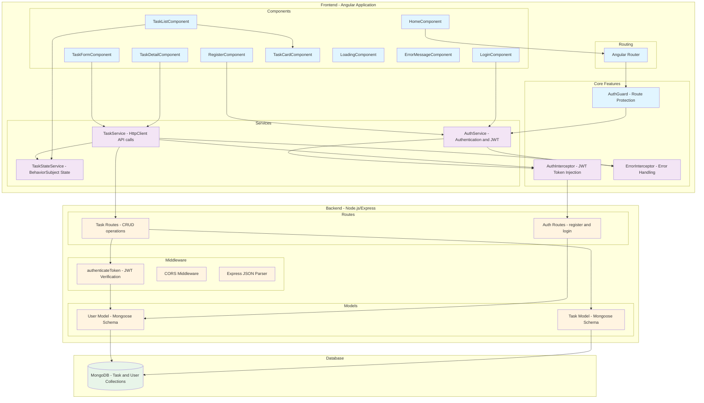
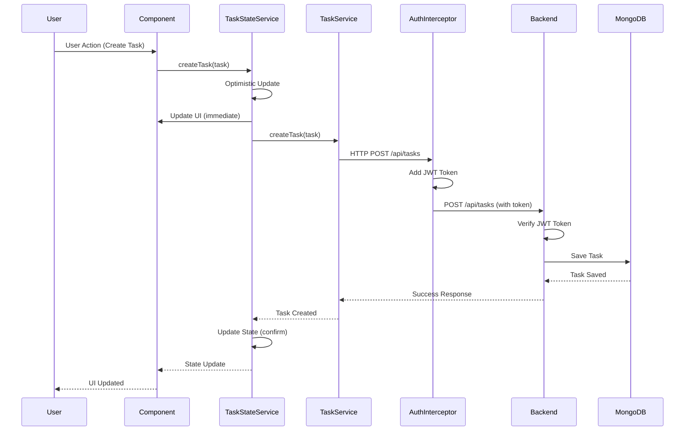
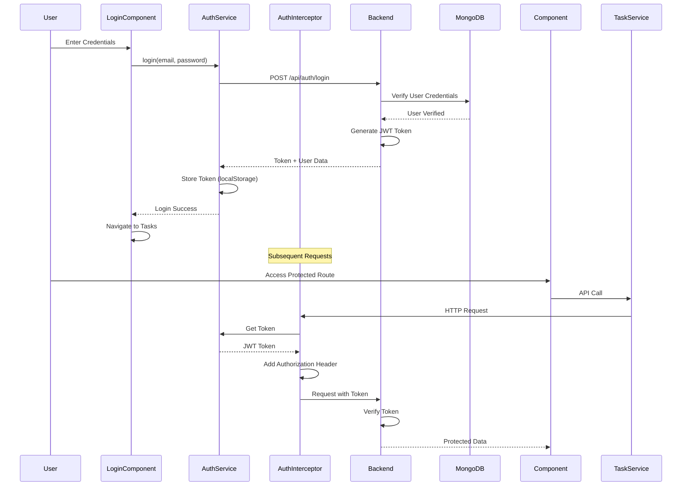
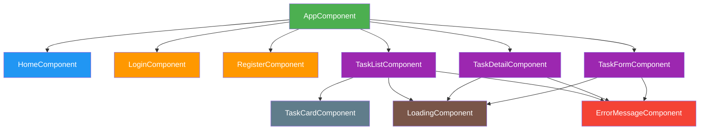
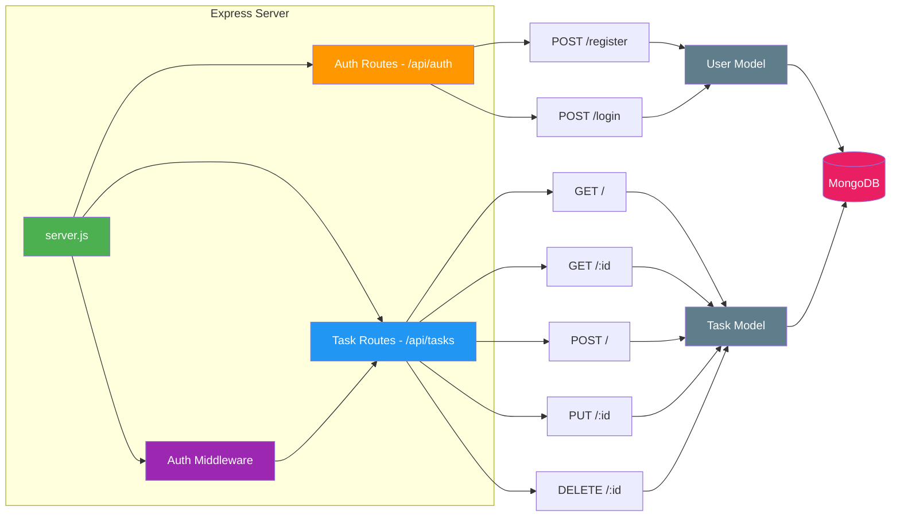
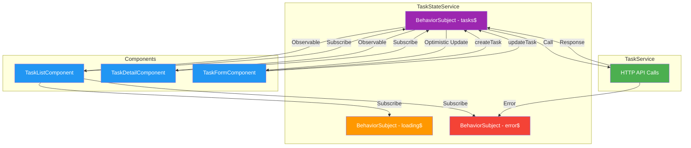
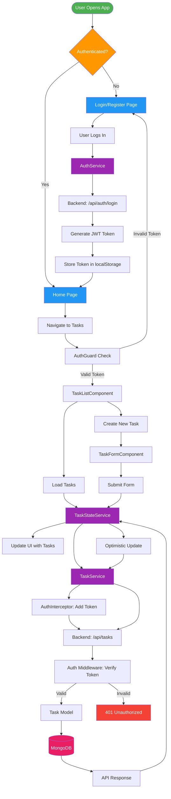

# Task App Architecture Diagram

## System Architecture Overview

## Data Flow Diagram

## Authentication Flow

## Component Hierarchy

## Backend API Structure

## State Management Flow

## Complete System Flow

