# Task App Architecture - Beginner's Guide

## 🎯 What is This App?

A simple task management app where users can:
- Create tasks
- View their tasks
- Update task status
- Delete tasks

---

## 📐 Level 1: The Big Picture (Simplest View)

```mermaid
graph LR
    User[👤 User] -->|Uses| Frontend[🌐 Angular App]
    Frontend -->|Sends Requests| Backend[⚙️ Express Server]
    Backend -->|Saves Data| Database[(💾 MongoDB)]
    
    style User fill:#4CAF50,color:#fff
    style Frontend fill:#2196F3,color:#fff
    style Backend fill:#FF9800,color:#fff
    style Database fill:#9C27B0,color:#fff
```

**What's happening?**
- **User** interacts with the **Angular App** (what they see)
- **Angular App** talks to the **Express Server** (the brain)
- **Express Server** stores data in **MongoDB** (the storage)

---

## 📐 Level 2: What's Inside the Frontend?

**Key Concept:** 
- **Components** = Different pages/parts of the app
- Each component has a job (show home, show tasks, etc.)

---

## 📐 Level 3: How Components Get Data

**Key Concept:**
- **Components** = What users see
- **Services** = How we get data
- Components ask Services, Services ask Backend

---

## 📐 Level 4: The Backend Structure

```mermaid
graph TD
    Request[HTTP Request] --> Routes[Routes<br/>What endpoint?]
    
    Routes -->|/api/auth| AuthRoutes[Auth Routes<br/>Login, Register]
    Routes -->|/api/tasks| TaskRoutes[Task Routes<br/>Create, Read, Update, Delete]
    
    TaskRoutes -->|Needs auth| AuthCheck[Auth Check<br/>Is user logged in?]
    AuthCheck -->|Yes| TaskModel[Task Model<br/>Save to database]
    AuthCheck -->|No| Reject[❌ Reject Request]
    
    TaskModel --> Database[(MongoDB)]
    
    style Request fill:#4CAF50,color:#fff
    style Routes fill:#2196F3,color:#fff
    style AuthRoutes fill:#FF9800,color:#fff
    style TaskRoutes fill:#9C27B0,color:#fff
    style AuthCheck fill:#F44336,color:#fff
    style TaskModel fill:#607D8B,color:#fff
    style Database fill:#E91E63,color:#fff
    style Reject fill:#F44336,color:#fff
```

**Key Concept:**
- **Routes** = Different URLs do different things
- **Auth Check** = Security (must be logged in)
- **Models** = How data is stored

---

## 📐 Level 5: Complete Flow - Creating a Task

**What happened?**
1. You fill out the form
2. Form sends data to Service
3. Service sends HTTP request to Backend
4. Backend saves to Database
5. Response comes back
6. You see success!

---

## 📐 Level 6: Authentication Flow

**Key Concept:**
- **JWT Token** = Your "ID card" for the app
- Token proves you're logged in
- Token is saved in browser storage

---

## 📐 Level 7: How Protected Routes Work

**Key Concept:**
- **Auth Guard** = Security guard for pages
- Checks if you're logged in before allowing access

---

## 🎓 Summary: The Three Main Parts

### 1. **Frontend (Angular)**
- What users see and interact with
- Components = Pages/UI elements
- Services = Get data from backend

### 2. **Backend (Express)**
- Handles requests
- Checks authentication
- Saves/retrieves data

### 3. **Database (MongoDB)**
- Stores all the data
- Tasks, users, etc.

---

## 🚀 Next Steps for Learning

1. **Start Simple**: Understand Level 1 (Big Picture)
2. **Learn Components**: Study Level 2 (Frontend structure)
3. **Understand Services**: Study Level 3 (How data flows)
4. **Explore Backend**: Study Level 4 (How backend works)
5. **See It In Action**: Study Level 5-7 (Complete flows)

---

## 💡 Key Terms Explained Simply

| Term | Simple Explanation |
|------|-------------------|
| **Component** | A piece of the UI (like a page or a button) |
| **Service** | Code that gets data from the backend |
| **Route** | A URL that does something specific |
| **API** | How frontend and backend talk to each other |
| **JWT Token** | Your login "ID card" |
| **Auth Guard** | Security that checks if you're logged in |
| **Model** | How data is structured in the database |

---

## 📚 Want More Detail?

See `ARCHITECTURE_DIAGRAM.md` for the complete technical architecture with all details.
