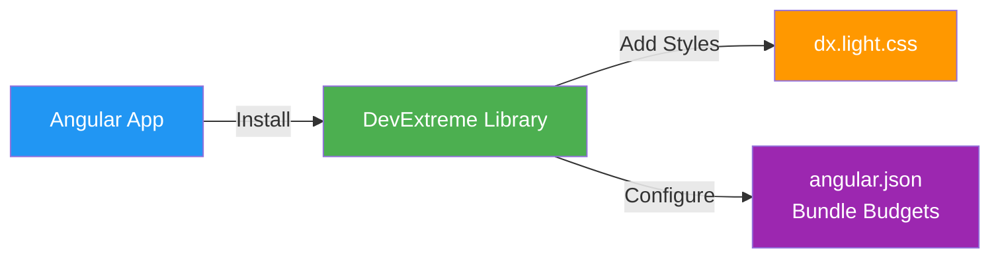

# COMMIT 01: Setup and DevExtreme Installation

## 📦 What Was Built

This commit sets up DevExtreme UI library in the Angular application. DevExtreme is a comprehensive UI component library that we'll use throughout the project for building a modern, professional-looking interface.

## 📊 Visual Overview



**What This Commit Does:**
- Installs DevExtreme UI library
- Adds theme styles
- Configures build settings

## 🎯 Topic Focus: Setup and Installation (Topic 01)

**Key Concepts Learned:**
- Installing third-party libraries in Angular projects
- Configuring external CSS themes
- Understanding package dependencies and version compatibility
- Adjusting build budgets for larger libraries

## 🔧 Changes Made

### 1. Package Installation
- Installed `devextreme@23.2.5` - Core DevExtreme library
- Installed `devextreme-angular@23.2.5` - Angular wrappers for DevExtreme components
- Used `--legacy-peer-deps` flag to handle Angular 17 compatibility

**Why version 23.2.5?**
- Latest DevExtreme (v25+) requires Angular 19+
- Our project uses Angular 17.3
- Version 23.2.5 is compatible with Angular 17

### 2. Styles Configuration
**File**: `src/styles.css`
```css
/* DevExtreme Theme Imports */
@import 'devextreme/dist/css/dx.light.css';
```

- Imported DevExtreme's light theme CSS
- This provides all the styling for DevExtreme components
- Available themes: `dx.light.css`, `dx.dark.css`, `dx.material.blue.css`, etc.

### 3. Build Configuration
**File**: `angular.json`
- Increased bundle size budgets:
  - `maximumWarning`: 500kB → 2MB
  - `maximumError`: 1MB → 3MB
- DevExtreme adds significant size to the bundle (~600KB for styles alone)
- This prevents build failures due to size limits

### 4. App Component
- Kept simple header structure for now
- DevExtreme components will be used in later steps
- Title property added for future use

## 📚 Key Concepts Explained

### Third-Party Libraries in Angular

**What are they?**
- Pre-built components and utilities created by other developers
- Save time by not building everything from scratch
- DevExtreme provides 100+ UI components (buttons, grids, forms, etc.)

**How to install:**
```bash
npm install package-name --save
```

**How to use:**
1. Import the module in your component
2. Add it to the `imports` array (for standalone components)
3. Use the component in your template

**Example (we'll use this later):**
```typescript
import { DxButtonModule } from 'devextreme-angular';

@Component({
  imports: [DxButtonModule]
})
```

```html
<dx-button text="Click Me" (onClick)="handleClick()"></dx-button>
```

### Build Budgets

**What are they?**
- Angular sets limits on bundle sizes to keep apps performant
- Warns/errors when bundles exceed limits
- Helps prevent accidentally including too much code

**Why increase them?**
- DevExtreme is a large library (by design - it includes many components)
- We need more space for the library's CSS and JavaScript
- Still important to monitor size and only import what we need

## ✅ Build Verification

- ✅ Build succeeds: `npm run build`
- ✅ No TypeScript errors
- ✅ DevExtreme styles loaded correctly
- ✅ Bundle size within new limits (812KB total)

## 🚀 What's Next

**Next Step: STEP 2 - Core Concepts & Basic Components**

We'll learn about:
- Component structure (TypeScript, HTML, CSS files)
- Template interpolation (`{{ }}`)
- Property binding `[property]`
- Creating our first feature components

**What we'll build:**
- `HomeComponent` - Welcome page
- Enhanced `TaskListComponent` - Display tasks with interpolation
- Basic data binding examples

---

## 💡 Tips for Learning

1. **Explore DevExtreme**: Visit [DevExtreme Documentation](https://js.devexpress.com/Documentation/) to see available components
2. **Theme Customization**: We can switch themes later by changing the CSS import
3. **Tree Shaking**: Angular will only include DevExtreme components we actually use

---

**Commit Message:**
```
feat(setup): install DevExtreme and configure basic setup

- Install devextreme@23.2.5 and devextreme-angular@23.2.5
- Import DevExtreme light theme in styles.css
- Increase bundle size budgets in angular.json
- Add title property to AppComponent

Topic: Setup and Installation (01)
```
