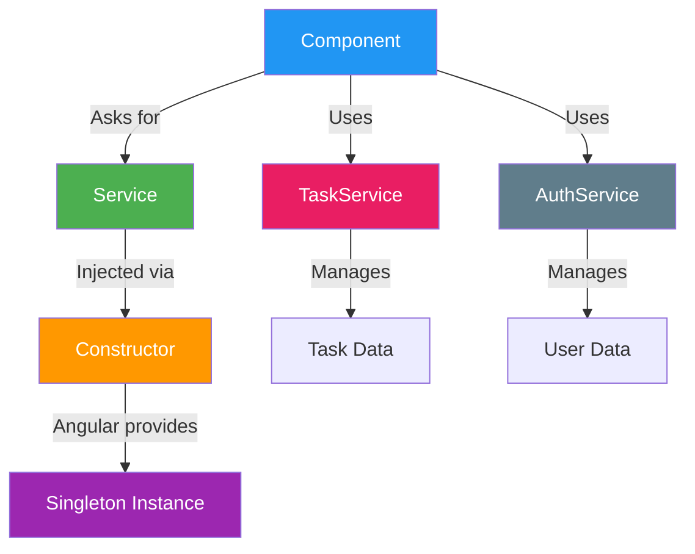

# COMMIT 05: Services & Dependency Injection

## 📦 What Was Built

This commit introduces Angular services and dependency injection. We created `TaskService` and `AuthService` to manage business logic and data, moving it out of components. Components now use dependency injection to access these services, following Angular best practices.

## 📊 Visual Overview



**What This Commit Teaches:**
- Services = Business logic outside components
- Dependency Injection = Angular provides services
- Singleton = One instance shared everywhere

## 🎯 Topic Focus: Services and Dependency Injection (06)

**Key Concepts Learned:**
- Creating services with `@Injectable()`
- Dependency Injection (DI) in Angular
- Singleton services with `providedIn: 'root'`
- Injecting services via constructor
- Separating business logic from components
- Component lifecycle hooks (`ngOnInit`)

## 🔧 Changes Made

### 1. Created TaskService

**File**: `src/app/core/services/task.service.ts`

**Key Features:**
- `@Injectable({ providedIn: 'root' })` - Makes service a singleton
- Private `tasks` array - Data encapsulation
- Public methods for CRUD operations
- Business logic methods (search, filter, count)

**Service Methods:**
```typescript
getAllTasks(): Task[]
getTaskById(id: string): Task | undefined
createTask(task: Omit<Task, '_id'>): Task
updateTask(id: string, updates: Partial<Task>): Task | null
deleteTask(id: string): boolean
updateTaskStatus(id: string, newStatus: string): Task | null
searchTasks(searchTerm: string): Task[]
getTasksByStatus(status: string): Task[]
getTaskCountByStatus(status: string): number
getTotalTaskCount(): number
```

### 2. Created AuthService

**File**: `src/app/core/services/auth.service.ts`

**Key Features:**
- User authentication state management
- Login/logout functionality
- Current user tracking
- Mock implementation (will use HTTP in Step 8)

**Service Methods:**
```typescript
isAuthenticated(): boolean
getCurrentUser(): User | null
login(email: string, password: string): boolean
register(email: string, password: string): boolean
logout(): void
getUserEmail(): string
```

### 3. Updated TaskListComponent

**Before (Step 4):**
```typescript
export class TaskListComponent {
  tasks: Task[] = [ /* hardcoded data */ ];
  
  onDeleteTask(taskId: string): void {
    this.tasks.splice(index, 1);
  }
}
```

**After (Step 5):**
```typescript
export class TaskListComponent implements OnInit {
  tasks: Task[] = [];
  
  constructor(private taskService: TaskService) {}
  
  ngOnInit(): void {
    this.loadTasks();
  }
  
  onDeleteTask(taskId: string): void {
    this.taskService.deleteTask(taskId);
    this.tasks = this.taskService.getAllTasks();
  }
}
```

**Key Changes:**
- Removed hardcoded data
- Injected `TaskService` via constructor
- Uses service methods for all operations
- Implements `OnInit` lifecycle hook

### 4. Updated HomeComponent

**Added:**
- Injected `TaskService` and `AuthService`
- Uses services to get task count and user info
- Shows personalized welcome message

## 📚 Key Concepts Explained

### What are Services?

**Services are:**
- Classes that contain business logic and data
- Reusable across multiple components
- Singleton by default (one instance for entire app)
- Used to separate concerns (components handle UI, services handle logic)

**Why use services?**
1. **Separation of Concerns**: Components focus on UI, services handle logic
2. **Reusability**: Same service can be used by multiple components
3. **Testability**: Services can be easily tested in isolation
4. **Data Sharing**: Single source of truth for data
5. **Maintainability**: Logic changes in one place

### @Injectable() Decorator

**What it does:**
- Marks a class as a service that can be injected
- Tells Angular this class can have dependencies injected into it
- Required for dependency injection to work

**Syntax:**
```typescript
@Injectable({
  providedIn: 'root' // Service is available app-wide
})
export class MyService {
  // Service code
}
```

**providedIn Options:**
- `'root'` - Singleton service, available app-wide (most common)
- `'platform'` - Single instance across multiple apps
- `'any'` - New instance for each lazy-loaded module
- Component class - Service scoped to that component

**Example:**
```typescript
@Injectable({
  providedIn: 'root'
})
export class TaskService {
  // This service will be a singleton
  // Same instance used everywhere in the app
}
```

### Dependency Injection (DI)

**What is Dependency Injection?**
- Design pattern where dependencies are provided to a class
- Angular automatically creates and provides service instances
- No need to manually create service objects

**How it works:**
1. Service is marked with `@Injectable()`
2. Component requests service in constructor
3. Angular creates service instance (or reuses existing)
4. Angular injects service into component

**Example:**
```typescript
// Service
@Injectable({ providedIn: 'root' })
export class TaskService {
  getTasks() { return []; }
}

// Component
@Component({...})
export class TaskListComponent {
  constructor(private taskService: TaskService) {
    // Angular automatically injects TaskService
    // 'private' creates a class property automatically
  }
  
  ngOnInit() {
    // Use the injected service
    const tasks = this.taskService.getTasks();
  }
}
```

**Constructor Injection:**
```typescript
// Method 1: Private (most common)
constructor(private taskService: TaskService) {
  // Creates: this.taskService
}

// Method 2: Public
constructor(public taskService: TaskService) {
  // Creates: this.taskService (accessible from template)
}

// Method 3: Multiple services
constructor(
  private taskService: TaskService,
  private authService: AuthService
) {
  // Both services injected
}
```

**Benefits:**
- **Loose Coupling**: Components don't create services directly
- **Testability**: Easy to mock services in tests
- **Flexibility**: Can swap implementations easily
- **Automatic**: Angular handles service creation

### Singleton Services

**What is a singleton?**
- Only one instance of the service exists
- All components share the same service instance
- Data persists across components

**How to create:**
```typescript
@Injectable({
  providedIn: 'root' // Makes it a singleton
})
export class TaskService {
  private tasks: Task[] = []; // Shared across all components
}
```

**Example:**
```typescript
// Component A
constructor(private taskService: TaskService) {
  this.taskService.createTask({ title: 'Task 1' });
}

// Component B
constructor(private taskService: TaskService) {
  // Gets the SAME service instance
  const tasks = this.taskService.getAllTasks(); // Includes 'Task 1'
}
```

**When to use:**
- Data that should be shared across components
- State management
- API communication
- Utility functions

### Component Lifecycle Hooks

**What are lifecycle hooks?**
- Methods that Angular calls at specific points in component lifecycle
- Allow you to run code at the right time

**Common Hooks:**

**1. ngOnInit:**
```typescript
export class TaskListComponent implements OnInit {
  ngOnInit(): void {
    // Called once after component initialization
    // Perfect for loading data from services
    this.loadTasks();
  }
}
```

**When to use:**
- Loading data from services
- Setting up subscriptions
- Initializing component state

**2. ngOnDestroy:**
```typescript
export class TaskListComponent implements OnDestroy {
  ngOnDestroy(): void {
    // Called when component is destroyed
    // Clean up subscriptions, timers, etc.
  }
}
```

**Other hooks (we'll use later):**
- `ngOnChanges` - When input properties change
- `ngAfterViewInit` - After view is initialized
- `ngDoCheck` - Custom change detection

### Service vs Component Responsibilities

**Components should:**
- Handle UI and user interactions
- Display data
- Handle events
- Use services for business logic

**Services should:**
- Contain business logic
- Manage data
- Handle API calls (Step 8)
- Provide reusable functionality

**Example:**

**Component (UI Logic):**
```typescript
export class TaskListComponent {
  constructor(private taskService: TaskService) {}
  
  onDeleteClick(taskId: string): void {
    // UI logic: confirm, show message, etc.
    if (confirm('Delete task?')) {
      this.taskService.deleteTask(taskId); // Delegate to service
      this.showSuccessMessage('Task deleted');
    }
  }
}
```

**Service (Business Logic):**
```typescript
export class TaskService {
  deleteTask(id: string): boolean {
    // Business logic: validation, deletion, etc.
    const index = this.tasks.findIndex(t => t._id === id);
    if (index === -1) return false;
    this.tasks.splice(index, 1);
    return true;
  }
}
```

## 💡 Code Highlights

### TaskService - Complete Service Example

```typescript
@Injectable({
  providedIn: 'root'
})
export class TaskService {
  private tasks: Task[] = []; // Private - encapsulated data
  
  getAllTasks(): Task[] {
    return [...this.tasks]; // Return copy
  }
  
  deleteTask(id: string): boolean {
    const index = this.tasks.findIndex(task => task._id === id);
    if (index === -1) return false;
    this.tasks.splice(index, 1);
    return true;
  }
}
```

**Key Points:**
- `@Injectable({ providedIn: 'root' })` - Singleton service
- Private data - Encapsulation
- Public methods - API for components
- Return copies - Prevent direct mutation

### Component with Dependency Injection

```typescript
@Component({...})
export class TaskListComponent implements OnInit {
  tasks: Task[] = [];
  
  // Dependency Injection via constructor
  constructor(private taskService: TaskService) {
    // Angular automatically provides TaskService instance
  }
  
  // Lifecycle hook
  ngOnInit(): void {
    this.loadTasks();
  }
  
  loadTasks(): void {
    this.tasks = this.taskService.getAllTasks();
  }
  
  onDeleteTask(taskId: string): void {
    this.taskService.deleteTask(taskId);
    this.tasks = this.taskService.getAllTasks();
  }
}
```

**Key Points:**
- Constructor injection - `constructor(private service: Service)`
- `implements OnInit` - Lifecycle hook interface
- `ngOnInit()` - Load data after initialization
- Use service methods - Don't access data directly

### Multiple Service Injection

```typescript
export class HomeComponent implements OnInit {
  constructor(
    private taskService: TaskService,
    private authService: AuthService
  ) {}
  
  ngOnInit(): void {
    this.taskCount = this.taskService.getTotalTaskCount();
    this.userEmail = this.authService.getUserEmail();
  }
}
```

**Key Points:**
- Inject multiple services in same constructor
- Each service is a separate parameter
- Angular provides instances automatically

## ✅ Build Verification

- ✅ Build succeeds: `npm run build`
- ✅ No TypeScript errors
- ✅ Services properly injected
- ✅ Components use services correctly
- ✅ Lifecycle hooks working

## 🚀 What's Next

**Next Step: STEP 6 - Routing**

We'll learn about:
- Router configuration
- Route parameters (`:id`)
- Navigation with `routerLink` and `Router`
- Route guards
- Child routes

**What we'll build:**
- Configure routes for task detail and form pages
- Create `TaskDetailComponent` and `TaskFormComponent`
- Navigation menu
- Use `ActivatedRoute` to get route parameters

---

## 💡 Tips for Learning

1. **Services are singletons**: Same instance shared everywhere
2. **Constructor injection**: Most common way to inject services
3. **providedIn: 'root'**: Makes service available app-wide
4. **ngOnInit**: Use for initialization, not constructor
5. **Separate concerns**: Components = UI, Services = Logic

## 🎓 Practice Exercises

Try these to reinforce learning:

1. Create a new service for notifications
2. Inject multiple services into a component
3. Add a method to TaskService that filters by due date
4. Create a service that tracks component usage
5. Move search logic from component to service (already done!)

---

**Commit Message:**
```
feat(services): create TaskService and AuthService with dependency injection

- Create TaskService with CRUD operations and business logic
- Create AuthService for authentication state management
- Update TaskListComponent to use TaskService via DI
- Update HomeComponent to use both services
- Implement OnInit lifecycle hook for data loading
- Demonstrate singleton services and constructor injection

Topic: Services and Dependency Injection (06)
Build: ✅ Verified successful (901KB bundle)
```
