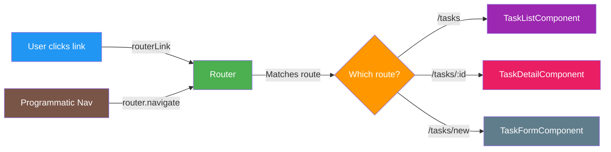

# COMMIT 06: Routing - Multiple Pages in SPA

## 📦 What Was Built

This commit implements Angular routing to create a single-page application (SPA) with multiple views. We created `TaskDetailComponent` and `TaskFormComponent`, configured routes with parameters, added navigation menu, and implemented programmatic navigation using the Router service.

## 📊 Visual Overview



**What This Commit Teaches:**
- Routes = Different URLs show different components
- Route params = `/tasks/:id` gets ID from URL
- Navigation = Click links or use Router service

## 🎯 Topic Focus: Routing (07)

**Key Concepts Learned:**
- Router configuration
- Route parameters (`:id`)
- Navigation with `routerLink` and `Router`
- `ActivatedRoute` for accessing route parameters
- Programmatic navigation
- Wildcard routes and redirects

## 🔧 Changes Made

### 1. Created TaskDetailComponent

**Files**: 
- `src/app/features/tasks/task-detail/task-detail.component.ts/html/css`

**Key Features:**
- Uses `ActivatedRoute` to get route parameter (`:id`)
- Loads task data from `TaskService`
- Displays task details
- Programmatic navigation with `Router`
- Edit and delete functionality

**Route Parameter Access:**
```typescript
this.route.paramMap.subscribe(params => {
  this.taskId = params.get('id');
  if (this.taskId) {
    this.loadTask(this.taskId);
  }
});
```

### 2. Created TaskFormComponent

**Files**: 
- `src/app/features/tasks/task-form/task-form.component.ts/html/css`

**Key Features:**
- Handles both create and edit modes
- Detects mode from route (`/tasks/new` vs `/tasks/:id/edit`)
- Uses template-driven forms (will be enhanced in Step 7)
- Navigation after save

**Route Detection:**
```typescript
this.route.paramMap.subscribe(params => {
  const id = params.get('id');
  if (id) {
    this.isEditMode = true;
    this.loadTask(id);
  } else {
    this.isEditMode = false; // New task mode
  }
});
```

### 3. Created NavigationComponent

**Files**: 
- `src/app/shared/navigation/navigation.component.ts/html/css`

**Key Features:**
- Navigation menu with `routerLink`
- Active route highlighting with `routerLinkActive`
- Responsive design

### 4. Updated Route Configuration

**File**: `src/app/app.routes.ts`

**Routes:**
```typescript
export const routes: Routes = [
  { path: '', component: HomeComponent },
  { path: 'tasks', component: TaskListComponent },
  { path: 'tasks/new', component: TaskFormComponent },
  { path: 'tasks/:id', component: TaskDetailComponent },
  { path: 'tasks/:id/edit', component: TaskFormComponent },
  { path: '**', redirectTo: '' } // Wildcard route
];
```

### 5. Updated App Component

- Added `NavigationComponent` to app template
- Navigation appears on all pages

## 📚 Key Concepts Explained

### What is Routing?

**Routing in Angular:**
- Allows navigation between different views without page reload
- Creates a Single Page Application (SPA)
- Changes URL and displays different components
- Maintains browser history (back/forward buttons work)

**Benefits:**
- Fast navigation (no full page reload)
- Better user experience
- Shareable URLs
- Browser history support

### Router Configuration

**Routes Array:**
```typescript
export const routes: Routes = [
  { path: 'path', component: ComponentClass }
];
```

**Route Properties:**
- `path` - URL path (e.g., `'tasks'`, `'tasks/:id'`)
- `component` - Component to display
- `redirectTo` - Redirect to another route
- `pathMatch` - Matching strategy

**Route Examples:**
```typescript
// Simple route
{ path: 'home', component: HomeComponent }

// Route with parameter
{ path: 'tasks/:id', component: TaskDetailComponent }

// Redirect
{ path: '', redirectTo: '/home', pathMatch: 'full' }

// Wildcard (catch-all)
{ path: '**', redirectTo: '/home' }
```

### Route Parameters

**What are route parameters?**
- Dynamic values in URL
- Marked with `:` (e.g., `:id`, `:userId`)
- Accessed via `ActivatedRoute`

**Defining Parameters:**
```typescript
{ path: 'tasks/:id', component: TaskDetailComponent }
// URL: /tasks/123
// Parameter: id = '123'
```

**Accessing Parameters:**

**Method 1: Snapshot (one-time)**
```typescript
constructor(private route: ActivatedRoute) {}

ngOnInit() {
  const id = this.route.snapshot.paramMap.get('id');
  // Use id
}
```

**Method 2: Observable (dynamic)**
```typescript
constructor(private route: ActivatedRoute) {}

ngOnInit() {
  this.route.paramMap.subscribe(params => {
    const id = params.get('id');
    // Use id - updates when route changes
  });
}
```

**When to use which:**
- **Snapshot**: When parameter won't change (component destroyed on route change)
- **Observable**: When same component can receive different parameters

**Our Example:**
```typescript
this.route.paramMap.subscribe(params => {
  this.taskId = params.get('id');
  if (this.taskId) {
    this.loadTask(this.taskId);
  }
});
```

### Navigation

**Two Ways to Navigate:**

**1. Template Navigation (routerLink):**
```html
<!-- Simple link -->
<a routerLink="/tasks">Tasks</a>

<!-- Link with parameter -->
<a [routerLink]="['/tasks', taskId]">View Task</a>

<!-- Link with query params -->
<a [routerLink]="['/tasks']" [queryParams]="{filter: 'active'}">Tasks</a>
```

**2. Programmatic Navigation (Router):**
```typescript
constructor(private router: Router) {}

navigateToTasks() {
  this.router.navigate(['/tasks']);
}

navigateToTask(id: string) {
  this.router.navigate(['/tasks', id]);
}

navigateWithQuery() {
  this.router.navigate(['/tasks'], {
    queryParams: { filter: 'active' }
  });
}
```

**Navigation Methods:**
- `router.navigate(['path'])` - Navigate (relative to current route)
- `router.navigateByUrl('/path')` - Navigate by absolute URL
- `router.navigate(['path'], { relativeTo: this.route })` - Relative navigation

### routerLink Directive

**Basic Usage:**
```html
<a routerLink="/tasks">Tasks</a>
```

**With Parameters:**
```html
<a [routerLink]="['/tasks', task._id]">View Task</a>
```

**With Query Parameters:**
```html
<a [routerLink]="['/tasks']" [queryParams]="{status: 'active'}">Active Tasks</a>
```

**Active Route Styling:**
```html
<a 
  routerLink="/tasks" 
  routerLinkActive="active"
  [routerLinkActiveOptions]="{exact: true}">
  Tasks
</a>
```

- `routerLinkActive` - CSS class applied when route is active
- `routerLinkActiveOptions` - Options for matching
  - `exact: true` - Match exact path
  - `exact: false` - Match if path starts with route

### ActivatedRoute Service

**What is ActivatedRoute?**
- Service that provides access to route information
- Injected via dependency injection
- Contains route parameters, query params, data

**Properties:**
```typescript
// Route parameters
this.route.paramMap.subscribe(params => {
  const id = params.get('id');
});

// Query parameters
this.route.queryParamMap.subscribe(params => {
  const filter = params.get('filter');
});

// Route data
const data = this.route.snapshot.data;
```

**Our Example:**
```typescript
constructor(
  private route: ActivatedRoute,
  private router: Router
) {}

ngOnInit() {
  // Get route parameter
  this.route.paramMap.subscribe(params => {
    this.taskId = params.get('id');
    this.loadTask(this.taskId!);
  });
}
```

### Router Service

**What is Router?**
- Service for programmatic navigation
- Injected via dependency injection
- Used in component TypeScript code

**Methods:**
```typescript
// Navigate to route
this.router.navigate(['/tasks']);

// Navigate with parameters
this.router.navigate(['/tasks', taskId]);

// Navigate with query params
this.router.navigate(['/tasks'], {
  queryParams: { filter: 'active' }
});

// Navigate by URL
this.router.navigateByUrl('/tasks/123');
```

**Our Example:**
```typescript
goBack(): void {
  this.router.navigate(['/tasks']);
}

editTask(): void {
  this.router.navigate(['/tasks', this.taskId, 'edit']);
}
```

### Wildcard Routes

**What are wildcard routes?**
- Catch-all route for unmatched paths
- Usually placed last in routes array
- Used for 404 pages or redirects

**Syntax:**
```typescript
{ path: '**', component: NotFoundComponent }
// or
{ path: '**', redirectTo: '/home' }
```

**Our Example:**
```typescript
{ path: '**', redirectTo: '' } // Redirect unknown routes to home
```

## 💡 Code Highlights

### TaskDetailComponent - Route Parameters

```typescript
export class TaskDetailComponent implements OnInit {
  task: Task | null = null;
  taskId: string | null = null;

  constructor(
    private route: ActivatedRoute,
    private router: Router,
    private taskService: TaskService
  ) {}

  ngOnInit(): void {
    // Get route parameter using observable
    this.route.paramMap.subscribe(params => {
      this.taskId = params.get('id');
      if (this.taskId) {
        this.loadTask(this.taskId);
      }
    });
  }

  goBack(): void {
    this.router.navigate(['/tasks']);
  }

  editTask(): void {
    this.router.navigate(['/tasks', this.taskId, 'edit']);
  }
}
```

**Key Points:**
- `ActivatedRoute` - Get route parameters
- `Router` - Programmatic navigation
- Observable subscription - Updates when route changes
- Navigation methods - `navigate()` and `navigateByUrl()`

### TaskFormComponent - Route Detection

```typescript
export class TaskFormComponent implements OnInit {
  isEditMode = false;
  taskId: string | null = null;

  ngOnInit(): void {
    this.route.paramMap.subscribe(params => {
      const id = params.get('id');
      if (id) {
        this.isEditMode = true;
        this.taskId = id;
        this.loadTask(id);
      } else {
        this.isEditMode = false; // New task
      }
    });
  }
}
```

**Key Points:**
- Detects mode from route
- `/tasks/new` - Create mode
- `/tasks/:id/edit` - Edit mode
- Loads task data if editing

### Navigation Component - routerLink

```html
<nav>
  <a routerLink="/" routerLinkActive="active" [routerLinkActiveOptions]="{exact: true}">
    Home
  </a>
  <a routerLink="/tasks" routerLinkActive="active">
    Tasks
  </a>
  <a routerLink="/tasks/new" routerLinkActive="active">
    New Task
  </a>
</nav>
```

**Key Points:**
- `routerLink` - Navigation directive
- `routerLinkActive` - Active route styling
- `routerLinkActiveOptions` - Matching options

## ✅ Build Verification

- ✅ Build succeeds: `npm run build`
- ✅ No TypeScript errors
- ✅ All routes configured correctly
- ✅ Navigation working
- ✅ Route parameters accessible
- ✅ Programmatic navigation functional

## 🚀 What's Next

**Next Step: STEP 7 - Forms with Validation**

We'll learn about:
- Reactive Forms (`FormBuilder`, `FormGroup`, `FormControl`)
- Form validation (required, minLength, custom validators)
- Form submission and error handling
- DevExtreme form components
- Template-driven vs Reactive forms

**What we'll build:**
- Complete `TaskFormComponent` with reactive forms
- Add validators for all fields
- Use DevExtreme form components
- Handle form submission and validation errors
- Pre-populate form for edit mode

---

## 💡 Tips for Learning

1. **Route order matters**: More specific routes should come first
2. **Wildcard last**: Always place `**` route at the end
3. **Observable vs Snapshot**: Use observable when route can change
4. **routerLink vs navigate**: Use `routerLink` in templates, `navigate` in code
5. **Active route styling**: Use `routerLinkActive` for navigation highlights

## 🎓 Practice Exercises

Try these to reinforce learning:

1. Add a route for user profile page
2. Create a route with multiple parameters (e.g., `/users/:userId/tasks/:taskId`)
3. Add query parameters to task list route for filtering
4. Create a 404 component and route
5. Add breadcrumb navigation using route data

---

**Commit Message:**
```
feat(routing): setup routing with task detail and form routes

- Create TaskDetailComponent with route parameter access
- Create TaskFormComponent for create/edit modes
- Create NavigationComponent with routerLink
- Configure routes: /, /tasks, /tasks/new, /tasks/:id, /tasks/:id/edit
- Implement ActivatedRoute for parameter access
- Add programmatic navigation with Router service
- Add wildcard route for unknown paths
- Update app component with navigation menu

Topic: Routing (07)
Build: ✅ Verified successful (935KB bundle)
```
