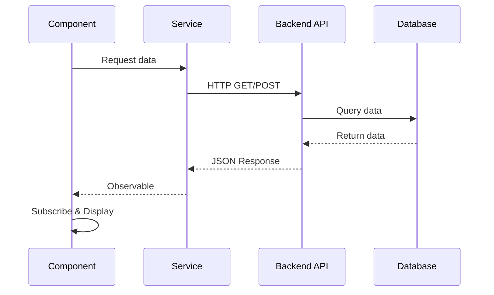

# COMMIT 08: HTTP and API Integration

## 📦 What Was Built

This commit integrates the Angular application with the backend API using `HttpClient`. We converted all service methods from synchronous mock data to asynchronous HTTP calls, implemented proper error handling, and updated all components to work with Observables.

## 📊 Visual Overview



**What This Commit Teaches:**
- HttpClient = Make HTTP requests
- Observables = Async data streams
- Subscribe = Get data when ready

## 🎯 Topic Focus: HTTP and APIs (09)

**Key Concepts Learned:**
- `HttpClient` service
- Making GET, POST, PUT, DELETE requests
- Observables in HTTP
- Error handling with RxJS operators
- Environment configuration
- Async data handling in components

## 🔧 Changes Made

### 1. Added HttpClient to Application

**File**: `src/main.ts`
```typescript
import { provideHttpClient } from '@angular/common/http';

bootstrapApplication(AppComponent, {
  providers: [
    provideRouter(routes),
    provideHttpClient() // Enable HttpClient
  ]
});
```

### 2. Created API Response Models

**File**: `src/app/shared/models/api-response.model.ts`
- `ApiResponse<T>` - Generic API response interface
- `TaskResponse` - Task-specific response
- `TasksResponse` - Tasks array response
- `AuthResponse` - Authentication response

### 3. Updated TaskService with HTTP

**Before (Step 5):**
```typescript
getAllTasks(): Task[] {
  return [...this.tasks];
}
```

**After (Step 8):**
```typescript
getAllTasks(): Observable<Task[]> {
  return this.http.get<TasksResponse>(this.apiUrl).pipe(
    map(response => {
      if (response.success && response.data) {
        return response.data.map(task => this.mapTaskFromApi(task));
      }
      throw new Error(response.error?.message || 'Failed to fetch tasks');
    }),
    catchError(this.handleError)
  );
}
```

**All Methods Updated:**
- `getAllTasks()` → Returns `Observable<Task[]>`
- `getTaskById()` → Returns `Observable<Task>`
- `createTask()` → Returns `Observable<Task>`
- `updateTask()` → Returns `Observable<Task>`
- `deleteTask()` → Returns `Observable<boolean>`
- `updateTaskStatus()` → Returns `Observable<Task>`
- `searchTasks()` → Returns `Observable<Task[]>`
- `getTasksByStatus()` → Returns `Observable<Task[]>`
- `getTaskCountByStatus()` → Returns `Observable<number>`
- `getTotalTaskCount()` → Returns `Observable<number>`

### 4. Updated AuthService with HTTP

**Before (Step 5):**
```typescript
login(email: string, password: string): boolean {
  // Mock implementation
  return true;
}
```

**After (Step 8):**
```typescript
login(email: string, password: string): Observable<User> {
  return this.http.post<AuthResponse>(`${this.apiUrl}/login`, { email, password }).pipe(
    map(response => {
      if (response.success && response.data) {
        const user: User = { id: response.data.user.id, email: response.data.user.email };
        this.setAuthData(response.data.token, user);
        return user;
      }
      throw new Error(response.error?.message || 'Login failed');
    }),
    catchError(this.handleError)
  );
}
```

**Features Added:**
- JWT token storage in localStorage
- User data persistence
- BehaviorSubject for reactive auth state
- Token management

### 5. Updated Components for Async Operations

**TaskListComponent:**
```typescript
// Before
this.tasks = this.taskService.getAllTasks();

// After
this.taskService.getAllTasks().subscribe({
  next: (tasks) => {
    this.tasks = tasks;
    this.totalTasks = tasks.length;
  },
  error: (error) => {
    console.error('Error loading tasks:', error);
    alert('Failed to load tasks. Please try again.');
  }
});
```

**All Components Updated:**
- TaskListComponent - Subscribes to getAllTasks()
- TaskDetailComponent - Subscribes to getTaskById()
- TaskFormComponent - Subscribes to createTask() and updateTask()
- HomeComponent - Subscribes to getTotalTaskCount()

### 6. Environment Configuration

**File**: `src/environments/environment.ts`
```typescript
export const environment = {
  production: false,
  apiUrl: 'http://localhost:3000/api'
};
```

## 📚 Key Concepts Explained

### HttpClient Service

**What is HttpClient?**
- Angular service for making HTTP requests
- Built on top of XMLHttpRequest and Fetch API
- Returns Observables (RxJS)
- Handles JSON automatically

**How to use:**
```typescript
import { HttpClient } from '@angular/common/http';

constructor(private http: HttpClient) {}

// GET request
this.http.get<ResponseType>(url).subscribe(data => {
  // Handle response
});
```

**HTTP Methods:**
- `get<T>(url)` - GET request
- `post<T>(url, body)` - POST request
- `put<T>(url, body)` - PUT request
- `delete<T>(url)` - DELETE request
- `patch<T>(url, body)` - PATCH request

### Observables in HTTP

**What are Observables?**
- Stream of data over time
- Can emit multiple values
- Can be cancelled
- Used for async operations

**HTTP Returns Observables:**
```typescript
// HTTP call returns Observable
const tasks$ = this.http.get<Task[]>('/api/tasks');

// Subscribe to get data
tasks$.subscribe({
  next: (tasks) => console.log(tasks),
  error: (error) => console.error(error),
  complete: () => console.log('Done')
});
```

**Why Observables?**
- Handle async operations
- Can be cancelled
- Can be transformed with operators
- Better than Promises for multiple values

### RxJS Operators

**Common Operators:**

**1. map - Transform data:**
```typescript
this.http.get<ApiResponse<Task[]>>(url).pipe(
  map(response => response.data) // Extract data from response
)
```

**2. catchError - Handle errors:**
```typescript
this.http.get<Task[]>(url).pipe(
  catchError(error => {
    console.error(error);
    return throwError(() => new Error('Failed to load'));
  })
)
```

**3. tap - Side effects:**
```typescript
this.http.get<Task[]>(url).pipe(
  tap(tasks => console.log('Loaded', tasks.length, 'tasks'))
)
```

**4. switchMap - Chain requests:**
```typescript
this.http.get<User>(url).pipe(
  switchMap(user => this.http.get<Task[]>(`/api/users/${user.id}/tasks`))
)
```

**Our Example:**
```typescript
getAllTasks(): Observable<Task[]> {
  return this.http.get<TasksResponse>(this.apiUrl).pipe(
    map(response => {
      if (response.success && response.data) {
        return response.data.map(task => this.mapTaskFromApi(task));
      }
      throw new Error(response.error?.message);
    }),
    catchError(this.handleError)
  );
}
```

### Error Handling

**HTTP Error Types:**
- Network errors (no connection)
- Server errors (500, 404, etc.)
- Client errors (400, 401, etc.)

**Error Handling Pattern:**
```typescript
private handleError(error: HttpErrorResponse): Observable<never> {
  let errorMessage = 'An unknown error occurred';
  
  if (error.error instanceof ErrorEvent) {
    // Client-side error
    errorMessage = `Error: ${error.error.message}`;
  } else {
    // Server-side error
    if (error.error?.error?.message) {
      errorMessage = error.error.error.message;
    } else {
      errorMessage = `Error Code: ${error.status}\nMessage: ${error.message}`;
    }
  }
  
  return throwError(() => new Error(errorMessage));
}
```

**Component Error Handling:**
```typescript
this.taskService.getAllTasks().subscribe({
  next: (tasks) => {
    // Success
    this.tasks = tasks;
  },
  error: (error) => {
    // Error
    console.error('Error:', error);
    alert('Failed to load tasks');
  }
});
```

### Subscribing to Observables

**Three Ways to Subscribe:**

**1. Simple subscription:**
```typescript
observable.subscribe(data => {
  // Handle data
});
```

**2. With error handling:**
```typescript
observable.subscribe({
  next: (data) => {
    // Handle success
  },
  error: (error) => {
    // Handle error
  }
});
```

**3. Complete subscription:**
```typescript
observable.subscribe({
  next: (data) => {
    // Handle success
  },
  error: (error) => {
    // Handle error
  },
  complete: () => {
    // Handle completion
  }
});
```

**Our Pattern:**
```typescript
this.taskService.getAllTasks().subscribe({
  next: (tasks) => {
    this.tasks = tasks;
    this.isLoading = false;
  },
  error: (error) => {
    console.error('Error:', error);
    alert('Failed to load tasks');
    this.isLoading = false;
  }
});
```

### Environment Configuration

**What is it?**
- Configuration files for different environments
- Development vs Production settings
- API URLs, feature flags, etc.

**Usage:**
```typescript
import { environment } from '../../../environments/environment';

private apiUrl = `${environment.apiUrl}/tasks`;
```

**Benefits:**
- Easy to switch between environments
- No hardcoded URLs
- Different configs for dev/prod

### Data Mapping

**Why map API responses?**
- API structure may differ from app models
- Transform dates from strings to Date objects
- Handle null/undefined values
- Ensure type safety

**Our Example:**
```typescript
private mapTaskFromApi(apiTask: any): Task {
  return {
    _id: apiTask._id,
    title: apiTask.title,
    description: apiTask.description || '',
    status: apiTask.status,
    dueDate: apiTask.dueDate ? new Date(apiTask.dueDate) : null,
    createdAt: apiTask.createdAt ? new Date(apiTask.createdAt) : undefined,
    updatedAt: apiTask.updatedAt ? new Date(apiTask.updatedAt) : undefined
  };
}
```

## 💡 Code Highlights

### Complete HTTP Service Example

```typescript
@Injectable({ providedIn: 'root' })
export class TaskService {
  private apiUrl = `${environment.apiUrl}/tasks`;

  constructor(private http: HttpClient) {}

  getAllTasks(): Observable<Task[]> {
    return this.http.get<TasksResponse>(this.apiUrl).pipe(
      map(response => {
        if (response.success && response.data) {
          return response.data.map(task => this.mapTaskFromApi(task));
        }
        throw new Error(response.error?.message || 'Failed to fetch tasks');
      }),
      catchError(this.handleError)
    );
  }

  createTask(task: Omit<Task, '_id'>): Observable<Task> {
    return this.http.post<TaskResponse>(this.apiUrl, task).pipe(
      map(response => {
        if (response.success && response.data) {
          return this.mapTaskFromApi(response.data);
        }
        throw new Error(response.error?.message || 'Failed to create task');
      }),
      catchError(this.handleError)
    );
  }

  private handleError(error: HttpErrorResponse): Observable<never> {
    // Error handling logic
    return throwError(() => new Error(errorMessage));
  }
}
```

### Component with HTTP Subscription

```typescript
export class TaskListComponent implements OnInit {
  tasks: Task[] = [];
  isLoading = false;

  constructor(private taskService: TaskService) {}

  ngOnInit(): void {
    this.loadTasks();
  }

  loadTasks(): void {
    this.isLoading = true;
    this.taskService.getAllTasks().subscribe({
      next: (tasks) => {
        this.tasks = tasks;
        this.isLoading = false;
      },
      error: (error) => {
        console.error('Error:', error);
        alert('Failed to load tasks');
        this.isLoading = false;
      }
    });
  }
}
```

## ✅ Build Verification

- ✅ Build succeeds: `npm run build`
- ✅ No TypeScript errors
- ✅ HttpClient properly configured
- ✅ All services return Observables
- ✅ Components handle async operations
- ✅ Error handling implemented

## 🚀 What's Next

**Next Step: STEP 9 - RxJS Essentials**

We'll learn about:
- More RxJS operators (switchMap, debounceTime, etc.)
- Using `async` pipe in templates
- Subscription management
- Combining multiple Observables
- Advanced Observable patterns

**What we'll build:**
- Use RxJS operators for data transformation
- Implement search with debounceTime
- Use async pipe in templates
- Handle multiple subscriptions
- Optimize Observable usage

---

## 💡 Tips for Learning

1. **Observables are lazy**: Nothing happens until you subscribe
2. **Always handle errors**: Use catchError or error callback
3. **Unsubscribe when done**: Prevent memory leaks (we'll cover this in Step 9)
4. **Use operators**: Transform data before subscribing
5. **Environment config**: Keep API URLs in environment files

## 🎓 Practice Exercises

Try these to reinforce learning:

1. Add retry logic for failed HTTP requests
2. Implement request cancellation
3. Add request timeout handling
4. Create a generic HTTP service wrapper
5. Add request/response interceptors (preview of Step 12)

---

**Commit Message:**
```
feat(http): integrate HttpClient with backend API

- Add provideHttpClient to main.ts
- Create API response model interfaces
- Update TaskService to use HTTP (GET, POST, PUT, DELETE)
- Update AuthService to use HTTP for login/register
- Implement error handling with catchError
- Add data mapping from API to models
- Update all components to handle Observables
- Configure environment API URL
- Add token storage in AuthService

Topic: HTTP and APIs (09)
Build: ✅ Verified successful (1.86MB bundle)
```
