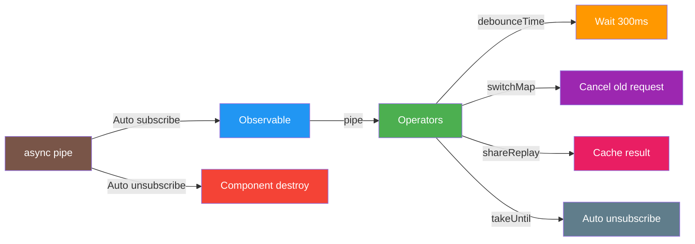

# COMMIT 09: RxJS Essentials

## 📦 What Was Built

This commit enhances the application with advanced RxJS operators and patterns. We implemented debounced search, caching with `shareReplay`, proper subscription management using `takeUntil`, and converted components to use the `async` pipe for automatic subscription handling.

## 📊 Visual Overview



**What This Commit Teaches:**
- RxJS Operators = Transform observables
- debounceTime = Wait before action
- async pipe = Auto subscribe/unsubscribe

## 🎯 Topic Focus: RxJS Essentials (10)

**Key Concepts Learned:**
- RxJS operators: `tap`, `switchMap`, `debounceTime`, `distinctUntilChanged`, `shareReplay`, `finalize`
- `async` pipe in templates
- Subscription management with `takeUntil` pattern
- `BehaviorSubject` for reactive state
- Observable composition with `combineLatest`
- Loading state observables

## 🔧 Changes Made

### 1. Enhanced TaskService with Advanced RxJS Operators

**File**: `src/app/core/services/task.service.ts`

#### Added Loading State Observable
```typescript
// Loading state observable
private loadingSubject = new BehaviorSubject<boolean>(false);
public loading$ = this.loadingSubject.asObservable();
```

#### Implemented Caching with shareReplay
```typescript
// Cache for tasks list (shareReplay)
private tasksCache$: Observable<Task[]> | null = null;

getAllTasks(): Observable<Task[]> {
  // Use cache if available (shareReplay pattern)
  if (!this.tasksCache$) {
    this.loadingSubject.next(true); // Set loading before request
    this.tasksCache$ = this.http.get<TasksResponse>(this.apiUrl).pipe(
      map(response => {
        if (response.success && response.data) {
          return response.data.map(task => this.mapTaskFromApi(task));
        }
        throw new Error(response.error?.message || 'Failed to fetch tasks');
      }),
      tap(() => this.loadingSubject.next(false)), // Side effect: clear loading on success
      catchError(error => {
        this.loadingSubject.next(false); // Clear loading on error
        return this.handleError(error);
      }),
      shareReplay(1) // Cache the result and share with multiple subscribers
    );
  }
  return this.tasksCache$;
}
```

**Benefits:**
- Multiple subscribers share the same HTTP request
- Results are cached and reused
- Reduces unnecessary API calls

#### Added Reactive Search with Debouncing
```typescript
// Search tasks by term with debounce - Returns Observable
searchTasksReactive(searchTerm$: Observable<string>): Observable<Task[]> {
  return searchTerm$.pipe(
    debounceTime(300), // Wait 300ms after user stops typing
    distinctUntilChanged(), // Only emit if value changed
    switchMap(term => {
      // switchMap cancels previous search if new one comes in
      if (!term.trim()) {
        return this.getAllTasks();
      }
      return this.getAllTasks().pipe(
        map(tasks => {
          const lowerTerm = term.toLowerCase();
          return tasks.filter(task =>
            task.title.toLowerCase().includes(lowerTerm) ||
            task.description.toLowerCase().includes(lowerTerm)
          );
        })
      );
    })
  );
}
```

**Operators Used:**
- `debounceTime(300)` - Waits 300ms after user stops typing before searching
- `distinctUntilChanged()` - Only emits if the search term actually changed
- `switchMap()` - Cancels previous search if a new one comes in

#### Enhanced CRUD Operations with tap and finalize
```typescript
createTask(task: Omit<Task, '_id' | 'createdAt' | 'updatedAt'>): Observable<Task> {
  this.loadingSubject.next(true); // Set loading before request
  return this.http.post<TaskResponse>(this.apiUrl, payload).pipe(
    map(response => {
      if (response.success && response.data) {
        return this.mapTaskFromApi(response.data);
      }
      throw new Error(response.error?.message || 'Failed to create task');
    }),
    tap(() => {
      this.clearCache(); // Clear cache after create (side effect)
    }),
    finalize(() => {
      this.loadingSubject.next(false); // Clear loading in finalize (always runs)
    }),
    catchError(error => {
      return this.handleError(error);
    })
  );
}
```

**Operators Used:**
- `tap()` - Side effects (logging, cache clearing) without modifying the stream
- `finalize()` - Always runs, even on error (perfect for cleanup like loading state)

### 2. Updated TaskListComponent with Async Pipe and Subscription Management

**File**: `src/app/features/tasks/task-list/task-list.component.ts`

#### Converted to Observable Properties
```typescript
// Observable properties for use with async pipe
tasks$: Observable<Task[]>;
filteredTasks$: Observable<Task[]>;
totalTasks$: Observable<number>;
taskCounts$: Observable<{ todo: number; doing: number; done: number }>;
isLoading$: Observable<boolean>;

// Search term subject for reactive search
private searchTermSubject = new BehaviorSubject<string>('');
searchTerm$ = this.searchTermSubject.asObservable();

// Subject for unsubscribing (takeUntil pattern)
private destroy$ = new Subject<void>();
```

#### Initialized Observables in Constructor
```typescript
constructor(private taskService: TaskService) {
  // Initialize observables using RxJS operators
  this.tasks$ = this.taskService.getAllTasks();
  
  // Create loading observable
  this.isLoading$ = this.taskService.loading$;
  
  // Create filtered tasks observable with debounced search
  this.filteredTasks$ = this.taskService.searchTasksReactive(
    this.searchTerm$.pipe(startWith(''))
  );
  
  // Create total tasks count observable
  this.totalTasks$ = this.tasks$.pipe(
    map(tasks => tasks.length)
  );
  
  // Create task counts observable using combineLatest
  this.taskCounts$ = combineLatest([
    this.taskService.getTaskCountByStatus('todo'),
    this.taskService.getTaskCountByStatus('doing'),
    this.taskService.getTaskCountByStatus('done')
  ]).pipe(
    map(([todo, doing, done]) => ({ todo, doing, done }))
  );
}
```

#### Implemented takeUntil Pattern for Subscription Management
```typescript
ngOnDestroy(): void {
  // Unsubscribe from all subscriptions using takeUntil pattern
  this.destroy$.next();
  this.destroy$.complete();
}

onDeleteTask(taskId: string): void {
  this.taskService.deleteTask(taskId).pipe(
    takeUntil(this.destroy$) // Auto-unsubscribe when component destroys
  ).subscribe({
    next: (success) => {
      if (success) {
        // Cache is cleared automatically, tasks$ will update
        console.log(`Task ${taskId} deleted`);
      }
    },
    error: (error) => {
      console.error('Error deleting task:', error);
      alert('Failed to delete task. Please try again.');
    }
  });
}
```

**Benefits:**
- Automatic unsubscription when component destroys
- Prevents memory leaks
- Cleaner code than manual unsubscribe

### 3. Updated Template to Use Async Pipe

**File**: `src/app/features/tasks/task-list/task-list.component.html`

#### Before (Manual Subscription)
```html
<p class="task-summary">
  Total: <strong>{{ totalTasks }}</strong> tasks | 
  Todo: <strong>{{ taskCounts['todo'] }}</strong> | 
  Doing: <strong>{{ taskCounts['doing'] }}</strong> | 
  Done: <strong>{{ taskCounts['done'] }}</strong>
</p>
```

#### After (Async Pipe)
```html
<p class="task-summary" *ngIf="taskCounts$ | async as counts">
  Total: <strong>{{ totalTasks$ | async }}</strong> tasks | 
  Todo: <strong>{{ counts.todo }}</strong> | 
  Doing: <strong>{{ counts.doing }}</strong> | 
  Done: <strong>{{ counts.done }}</strong>
</p>
```

#### Loading State with Async Pipe
```html
<!-- *ngIf directive: Show loading state conditionally using async pipe -->
<div class="loading-container" *ngIf="isLoading$ | async">
  <p class="loading-message">Loading tasks...</p>
</div>
```

#### Task List with Async Pipe
```html
<ng-container *ngIf="searchTerm; else showAllTasks">
  <div class="tasks-grid" *ngIf="(filteredTasks$ | async) as filteredTasks">
    <app-task-item 
      *ngFor="let task of filteredTasks; let i = index" 
      [task]="task"
      [taskIndex]="i"
      (deleteTask)="onDeleteTask($event)"
      (editTask)="onEditTask($event)"
      (statusChange)="onStatusChange($event)">
    </app-task-item>
  </div>
</ng-container>
```

**Benefits of Async Pipe:**
- Automatic subscription and unsubscription
- No need for manual subscription management in component
- Handles null/undefined values gracefully
- Cleaner template code

### 4. Updated HomeComponent to Use Async Pipe

**File**: `src/app/features/home/home.component.ts`

#### Before (Manual Subscription)
```typescript
taskCount = 0;

ngOnInit(): void {
  this.taskService.getTotalTaskCount().subscribe({
    next: (count) => {
      this.taskCount = count;
    },
    error: (error) => {
      console.error('Error loading task count:', error);
    }
  });
}
```

#### After (Async Pipe)
```typescript
// Observable property for use with async pipe
taskCount$: Observable<number>;

constructor(
  private taskService: TaskService,
  private authService: AuthService
) {
  // Use Observable directly - will be used with async pipe in template
  this.taskCount$ = this.taskService.getTotalTaskCount();
}

ngOnInit(): void {
  // No need to subscribe - using async pipe in template
  // The async pipe automatically handles subscription and unsubscription
}
```

**Template:**
```html
<p>You have <strong>{{ taskCount$ | async }}</strong> tasks to complete.</p>
```

## 📚 Key Concepts Explained

### RxJS Operators

#### 1. `tap` - Side Effects
```typescript
.pipe(
  tap(value => console.log('Value:', value)), // Log without modifying
  tap(() => this.clearCache()) // Clear cache as side effect
)
```
- Used for side effects (logging, state updates)
- Doesn't modify the stream
- Runs for every emission

#### 2. `switchMap` - Cancel Previous Requests
```typescript
searchTerm$.pipe(
  switchMap(term => this.searchTasks(term))
)
```
- Cancels previous inner observable when new one emits
- Perfect for search/debounce scenarios
- Prevents race conditions

#### 3. `debounceTime` - Delay Emissions
```typescript
searchTerm$.pipe(
  debounceTime(300) // Wait 300ms after last emission
)
```
- Waits for a pause in emissions
- Reduces API calls during typing
- Common for search inputs

#### 4. `distinctUntilChanged` - Skip Duplicates
```typescript
searchTerm$.pipe(
  distinctUntilChanged() // Only emit if value changed
)
```
- Skips emissions if value hasn't changed
- Reduces unnecessary processing
- Works with primitive and object values

#### 5. `shareReplay` - Cache and Share
```typescript
this.http.get(url).pipe(
  shareReplay(1) // Cache last value, share with subscribers
)
```
- Caches the last emitted value
- Shares subscription among multiple subscribers
- Reduces duplicate HTTP requests

#### 6. `finalize` - Always Run Cleanup
```typescript
this.http.post(url, data).pipe(
  finalize(() => {
    this.loading = false; // Always runs, even on error
  })
)
```
- Always executes, even on error
- Perfect for cleanup (loading states, etc.)
- Runs after complete or error

#### 7. `combineLatest` - Combine Multiple Observables
```typescript
combineLatest([
  this.getTodoCount(),
  this.getDoingCount(),
  this.getDoneCount()
]).pipe(
  map(([todo, doing, done]) => ({ todo, doing, done }))
)
```
- Combines latest values from multiple observables
- Emits when any source emits (after all have emitted once)
- Useful for aggregating data

### Async Pipe

**What is it?**
- Built-in Angular pipe that subscribes to Observables
- Automatically unsubscribes when component destroys
- Handles null/undefined values

**Usage:**
```html
<!-- Simple usage -->
<p>{{ taskCount$ | async }}</p>

<!-- With *ngIf (recommended) -->
<div *ngIf="tasks$ | async as tasks">
  <p>Total: {{ tasks.length }}</p>
</div>

<!-- Multiple async pipes -->
<div *ngIf="(tasks$ | async) && (isLoading$ | async) === false">
  <!-- Content -->
</div>
```

**Benefits:**
- No manual subscription needed
- Automatic cleanup
- Cleaner component code
- Type-safe with `as` syntax

### Subscription Management

#### The Problem
```typescript
// ❌ BAD: Memory leak if component destroys before subscription completes
ngOnInit() {
  this.taskService.getAllTasks().subscribe(tasks => {
    this.tasks = tasks;
  });
}
```

#### Solution 1: takeUntil Pattern (Recommended)
```typescript
private destroy$ = new Subject<void>();

ngOnInit() {
  this.taskService.getAllTasks().pipe(
    takeUntil(this.destroy$)
  ).subscribe(tasks => {
    this.tasks = tasks;
  });
}

ngOnDestroy() {
  this.destroy$.next();
  this.destroy$.complete();
}
```

#### Solution 2: Async Pipe (Best for Templates)
```typescript
// Component
tasks$ = this.taskService.getAllTasks();

// Template
<div *ngIf="tasks$ | async as tasks">
  <!-- Use tasks here -->
</div>
```

## 🎓 Learning Outcomes

After this commit, you should understand:

1. **RxJS Operators**
   - When to use `tap` for side effects
   - How `switchMap` cancels previous requests
   - Why `debounceTime` improves performance
   - How `shareReplay` reduces API calls
   - When `finalize` is better than `tap` for cleanup

2. **Async Pipe**
   - How to use `async` pipe in templates
   - Why it's better than manual subscriptions
   - How to handle multiple observables
   - Using `as` syntax for type safety

3. **Subscription Management**
   - Why unsubscription is important
   - How `takeUntil` pattern works
   - When to use async pipe vs manual subscription
   - Preventing memory leaks

4. **Observable Composition**
   - Using `combineLatest` to aggregate data
   - Chaining operators with `pipe()`
   - Creating reactive data flows

## 🚀 What's Next

**Next Step: STEP 10 - State Management**

We'll learn about:
- `BehaviorSubject` for reactive state management
- Centralized state service
- Sharing state across components
- Optimistic updates

**What we'll build:**
- Create `TaskStateService` with `BehaviorSubject`
- Manage task list state centrally
- Update state on CRUD operations
- Components subscribe to state changes

---

## 💡 Tips for Learning

1. **Operator Order Matters**: Operators execute in order, so `debounceTime` before `switchMap` is different from `switchMap` before `debounceTime`
2. **Async Pipe is Your Friend**: Use it whenever possible in templates - it handles everything automatically
3. **takeUntil Pattern**: Use this for manual subscriptions in components
4. **shareReplay for Caching**: Use when multiple components need the same data
5. **finalize for Cleanup**: Always use `finalize` for cleanup that must run even on error

## 🎓 Practice Exercises

Try these to reinforce learning:

1. Add `retry` operator to retry failed HTTP requests
2. Implement `throttleTime` for a different debounce behavior
3. Use `mergeMap` instead of `switchMap` and see the difference
4. Create a custom operator for common transformations
5. Implement request cancellation with `takeUntil`

---

**Commit Message:**
```
feat(rxjs): implement RxJS operators for data transformation and async handling

- Add tap, switchMap, debounceTime, distinctUntilChanged, shareReplay, finalize operators
- Implement debounced search with reactive patterns
- Add loading state observable with BehaviorSubject
- Implement caching with shareReplay to reduce API calls
- Convert TaskListComponent to use async pipe and takeUntil pattern
- Convert HomeComponent to use async pipe
- Update templates to use async pipe for automatic subscription management
- Add proper subscription cleanup with takeUntil pattern
- Use combineLatest for aggregating task counts

Topic: RxJS Essentials (10)
Build: ✅ Verified successful (1.88MB bundle)
```
