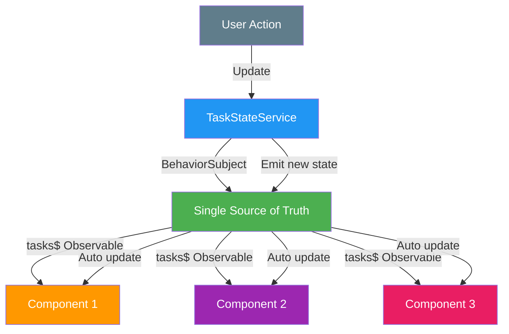

# COMMIT 10: State Management with BehaviorSubject

## 📦 What Was Built

This commit implements centralized state management using RxJS `BehaviorSubject`. We created a `TaskStateService` that manages all task data in a single source of truth, enabling automatic UI updates across all components. The service implements optimistic updates for better user experience.

## 📊 Visual Overview



**What This Commit Teaches:**
- BehaviorSubject = State container
- Single source of truth
- All components get updates automatically

## 🎯 Topic Focus: State Management (11)

**Key Concepts Learned:**
- `BehaviorSubject` for reactive state management
- Centralized state service pattern
- Optimistic updates
- Single source of truth
- State synchronization across components
- Rollback on error

## 🔧 Changes Made

### 1. Created TaskStateService

**File**: `src/app/state/task-state.service.ts`

#### Core State Management with BehaviorSubject
```typescript
@Injectable({
  providedIn: 'root'
})
export class TaskStateService {
  // Private BehaviorSubject to hold the current state
  // BehaviorSubject requires an initial value and emits current value to new subscribers
  private tasksSubject = new BehaviorSubject<Task[]>([]);
  
  // Public observable that components can subscribe to
  // Using asObservable() prevents external code from calling next() directly
  public tasks$: Observable<Task[]> = this.tasksSubject.asObservable();
  
  // Loading state
  private loadingSubject = new BehaviorSubject<boolean>(false);
  public loading$: Observable<boolean> = this.loadingSubject.asObservable();
  
  // Error state
  private errorSubject = new BehaviorSubject<string | null>(null);
  public error$: Observable<string | null> = this.errorSubject.asObservable();
}
```

**Why BehaviorSubject?**
- Emits current value immediately to new subscribers
- Maintains state (unlike regular Subject)
- Perfect for state management
- Components get current state even if they subscribe late

#### State Initialization
```typescript
constructor(private taskService: TaskService) {
  // Initialize state by loading tasks
  this.loadTasks();
}

loadTasks(): void {
  if (this.loadingSubject.value) {
    // Already loading, don't make duplicate request
    return;
  }

  this.loadingSubject.next(true);
  this.errorSubject.next(null);

  this.taskService.getAllTasks().pipe(
    tap(tasks => {
      // Update state with loaded tasks
      this.tasksSubject.next(tasks);
      this.initialized = true;
      this.loadingSubject.next(false);
    }),
    catchError(error => {
      this.errorSubject.next(error.message || 'Failed to load tasks');
      this.loadingSubject.next(false);
      return throwError(() => error);
    })
  ).subscribe();
}
```

#### Optimistic Updates - Create Task
```typescript
createTask(task: Omit<Task, '_id' | 'createdAt' | 'updatedAt'>): Observable<Task> {
  // Create temporary task with temporary ID for optimistic update
  const tempTask: Task = {
    _id: `temp-${Date.now()}`,
    ...task,
    createdAt: new Date(),
    updatedAt: new Date()
  };

  // Optimistic update: Add to state immediately
  const currentTasks = this.tasksSubject.value;
  this.tasksSubject.next([...currentTasks, tempTask]);
  this.loadingSubject.next(true);
  this.errorSubject.next(null);

  // Make API call
  return this.taskService.createTask(task).pipe(
    tap(newTask => {
      // Replace temporary task with real task from server
      const updatedTasks = this.tasksSubject.value.map(t =>
        t._id === tempTask._id ? newTask : t
      );
      this.tasksSubject.next(updatedTasks);
      this.loadingSubject.next(false);
    }),
    catchError(error => {
      // Rollback optimistic update on error
      const tasksWithoutTemp = this.tasksSubject.value.filter(
        t => t._id !== tempTask._id
      );
      this.tasksSubject.next(tasksWithoutTemp);
      this.errorSubject.next(error.message || 'Failed to create task');
      this.loadingSubject.next(false);
      return throwError(() => error);
    })
  );
}
```

**Benefits of Optimistic Updates:**
- UI updates immediately (better UX)
- User sees changes right away
- Rollback on error maintains data consistency
- Feels faster and more responsive

#### Optimistic Updates - Update Task
```typescript
updateTask(id: string, updates: Partial<Task>): Observable<Task> {
  const currentTasks = this.tasksSubject.value;
  const taskIndex = currentTasks.findIndex(t => t._id === id);
  
  if (taskIndex === -1) {
    return throwError(() => new Error('Task not found in state'));
  }

  // Optimistic update: Update state immediately
  const originalTask = currentTasks[taskIndex];
  const optimisticTask: Task = {
    ...originalTask,
    ...updates,
    updatedAt: new Date()
  };

  const updatedTasks = [...currentTasks];
  updatedTasks[taskIndex] = optimisticTask;
  this.tasksSubject.next(updatedTasks);
  this.loadingSubject.next(true);
  this.errorSubject.next(null);

  // Make API call
  return this.taskService.updateTask(id, updates).pipe(
    tap(updatedTask => {
      // Replace optimistic update with real update from server
      const finalTasks = this.tasksSubject.value.map(t =>
        t._id === id ? updatedTask : t
      );
      this.tasksSubject.next(finalTasks);
      this.loadingSubject.next(false);
    }),
    catchError(error => {
      // Rollback optimistic update on error
      const rolledBackTasks = [...currentTasks];
      rolledBackTasks[taskIndex] = originalTask;
      this.tasksSubject.next(rolledBackTasks);
      this.errorSubject.next(error.message || 'Failed to update task');
      this.loadingSubject.next(false);
      return throwError(() => error);
    })
  );
}
```

#### Optimistic Updates - Delete Task
```typescript
deleteTask(id: string): Observable<boolean> {
  const currentTasks = this.tasksSubject.value;
  const taskToDelete = currentTasks.find(t => t._id === id);
  
  if (!taskToDelete) {
    return throwError(() => new Error('Task not found in state'));
  }

  // Optimistic update: Remove from state immediately
  const tasksWithoutDeleted = currentTasks.filter(t => t._id !== id);
  this.tasksSubject.next(tasksWithoutDeleted);
  this.loadingSubject.next(true);
  this.errorSubject.next(null);

  // Make API call
  return this.taskService.deleteTask(id).pipe(
    tap(() => {
      // State already updated optimistically, just clear loading
      this.loadingSubject.next(false);
    }),
    catchError(error => {
      // Rollback optimistic update on error
      this.tasksSubject.next(currentTasks);
      this.errorSubject.next(error.message || 'Failed to delete task');
      this.loadingSubject.next(false);
      return throwError(() => error);
    })
  );
}
```

#### Derived Observables
```typescript
// Get tasks by status
getTasksByStatus(status: 'todo' | 'doing' | 'done'): Observable<Task[]> {
  return this.tasks$.pipe(
    map(tasks => tasks.filter(task => task.status === status))
  );
}

// Get task count by status
getTaskCountByStatus(status: string): Observable<number> {
  return this.tasks$.pipe(
    map(tasks => tasks.filter(task => task.status === status).length)
  );
}

// Get task counts for all statuses
getTaskCounts(): Observable<{ todo: number; doing: number; done: number }> {
  return this.tasks$.pipe(
    map(tasks => ({
      todo: tasks.filter(t => t.status === 'todo').length,
      doing: tasks.filter(t => t.status === 'doing').length,
      done: tasks.filter(t => t.status === 'done').length
    }))
  );
}
```

### 2. Updated TaskListComponent to Use State Service

**File**: `src/app/features/tasks/task-list/task-list.component.ts`

#### Before (Direct TaskService)
```typescript
constructor(private taskService: TaskService) {
  this.tasks$ = this.taskService.getAllTasks();
  this.isLoading$ = this.taskService.loading$;
  // ...
}

onDeleteTask(taskId: string): void {
  this.taskService.deleteTask(taskId).subscribe({
    next: (success) => {
      if (success) {
        this.loadTasks(); // Manual refresh needed
      }
    }
  });
}
```

#### After (TaskStateService)
```typescript
constructor(private taskStateService: TaskStateService) {
  // Get observables from state service
  // State service manages all task data centrally
  this.tasks$ = this.taskStateService.tasks$;
  
  // Get loading state from state service
  this.isLoading$ = this.taskStateService.loading$;
  
  // Get task counts from state service
  this.taskCounts$ = this.taskStateService.getTaskCounts();
  
  // Create filtered tasks observable with search
  // Combine tasks$ and searchTerm$ to react to both changes
  this.filteredTasks$ = combineLatest([
    this.tasks$,
    this.searchTerm$.pipe(startWith(''))
  ]).pipe(
    map(([tasks, searchTerm]) => {
      if (!searchTerm.trim()) {
        return tasks;
      }
      const lowerTerm = searchTerm.toLowerCase();
      return tasks.filter(task =>
        task.title.toLowerCase().includes(lowerTerm) ||
        task.description.toLowerCase().includes(lowerTerm)
      );
    })
  );
}

onDeleteTask(taskId: string): void {
  // State service handles optimistic updates automatically
  this.taskStateService.deleteTask(taskId).subscribe({
    next: (success) => {
      // State is updated automatically via BehaviorSubject
      // UI updates reactively without manual refresh
      console.log(`Task ${taskId} deleted`);
    }
  });
}
```

**Benefits:**
- No manual refresh needed
- UI updates automatically when state changes
- Single source of truth
- Optimistic updates improve UX

### 3. Updated TaskFormComponent to Use State Service

**File**: `src/app/features/tasks/task-form/task-form.component.ts`

#### Before
```typescript
this.taskService.createTask({...}).subscribe({
  next: (newTask) => {
    this.router.navigate(['/tasks', newTask._id]);
  }
});
```

#### After
```typescript
// Create new task using state service
// State service handles optimistic updates automatically
this.taskStateService.createTask({...}).subscribe({
  next: (newTask) => {
    // State is updated automatically, navigate to detail view
    this.router.navigate(['/tasks', newTask._id]);
  }
});
```

### 4. Updated TaskDetailComponent to Use State Service

**File**: `src/app/features/tasks/task-detail/task-detail.component.ts`

#### Smart Task Loading
```typescript
loadTask(id: string): void {
  this.isLoading = true;
  this.error = null;

  // First, try to get task from state (faster, no API call needed)
  const taskFromState = this.taskStateService.getTaskById(id);
  if (taskFromState) {
    this.task = taskFromState;
    this.isLoading = false;
    return;
  }

  // If not in state, load from API
  // This can happen if user navigates directly to detail URL
  this.taskService.getTaskById(id).subscribe({
    next: (task) => {
      this.task = task;
      this.isLoading = false;
    }
  });
}
```

**Benefits:**
- Faster loading if task is already in state
- No unnecessary API calls
- Fallback to API if needed

### 5. Updated HomeComponent to Use State Service

**File**: `src/app/features/home/home.component.ts`

```typescript
constructor(
  private taskStateService: TaskStateService,
  private authService: AuthService
) {
  // Use Observable from state service - will be used with async pipe in template
  // State service provides reactive task count
  this.taskCount$ = this.taskStateService.getTotalTaskCount();
}
```

## 📚 Key Concepts Explained

### BehaviorSubject vs Subject

#### Subject
```typescript
const subject = new Subject<string>();
subject.subscribe(value => console.log(value));
subject.next('Hello'); // Subscriber receives 'Hello'
subject.next('World'); // Subscriber receives 'World'
```

**Characteristics:**
- Doesn't hold current value
- New subscribers don't get previous values
- Only receives values emitted after subscription

#### BehaviorSubject
```typescript
const behaviorSubject = new BehaviorSubject<string>('Initial');
behaviorSubject.subscribe(value => console.log(value)); // Immediately receives 'Initial'
behaviorSubject.next('Hello'); // Receives 'Hello'
behaviorSubject.next('World'); // Receives 'World'

// New subscriber
behaviorSubject.subscribe(value => console.log(value)); // Immediately receives 'World' (current value)
```

**Characteristics:**
- Holds current value
- New subscribers immediately receive current value
- Perfect for state management
- Requires initial value

### State Management Patterns

#### 1. Single Source of Truth
```typescript
// ❌ BAD: Multiple components managing their own state
class TaskListComponent {
  tasks: Task[] = [];
  loadTasks() { /* ... */ }
}

class HomeComponent {
  taskCount: number = 0;
  loadCount() { /* ... */ }
}
```

```typescript
// ✅ GOOD: Centralized state service
class TaskStateService {
  private tasksSubject = new BehaviorSubject<Task[]>([]);
  public tasks$ = this.tasksSubject.asObservable();
}

class TaskListComponent {
  tasks$ = this.taskStateService.tasks$;
}

class HomeComponent {
  taskCount$ = this.taskStateService.getTotalTaskCount();
}
```

#### 2. Reactive Updates
```typescript
// Components automatically update when state changes
this.tasks$ = this.taskStateService.tasks$;

// In template
<div *ngFor="let task of tasks$ | async">
  {{ task.title }}
</div>
```

**Benefits:**
- No manual refresh needed
- All components stay in sync
- Automatic UI updates

#### 3. Optimistic Updates

**What are Optimistic Updates?**
- Update UI immediately before API call completes
- Rollback if API call fails
- Better user experience (feels faster)

**Example Flow:**
1. User clicks delete
2. Task removed from UI immediately (optimistic)
3. API call made in background
4. If success: Keep UI as is
5. If error: Rollback (restore task in UI)

**Implementation:**
```typescript
deleteTask(id: string): Observable<boolean> {
  // 1. Save current state (for rollback)
  const currentTasks = this.tasksSubject.value;
  
  // 2. Optimistic update (remove immediately)
  const tasksWithoutDeleted = currentTasks.filter(t => t._id !== id);
  this.tasksSubject.next(tasksWithoutDeleted);
  
  // 3. Make API call
  return this.taskService.deleteTask(id).pipe(
    catchError(error => {
      // 4. Rollback on error
      this.tasksSubject.next(currentTasks);
      return throwError(() => error);
    })
  );
}
```

### State Service Architecture

```
┌─────────────────────────────────────────┐
│         TaskStateService                │
│  ┌──────────────────────────────────┐  │
│  │  BehaviorSubject<Task[]>         │  │
│  │  - Holds current state            │  │
│  │  - Emits to all subscribers      │  │
│  └──────────────────────────────────┘  │
│           │                              │
│           │ tasks$ (Observable)          │
│           │                              │
└───────────┼──────────────────────────────┘
            │
    ┌───────┴───────┐
    │               │
┌───▼───┐    ┌──────▼──────┐
│TaskList│    │HomeComponent│
│Component│    │             │
└────────┘    └─────────────┘
```

**Flow:**
1. TaskStateService loads tasks on initialization
2. Components subscribe to `tasks$` observable
3. When state changes (create/update/delete), BehaviorSubject emits new value
4. All subscribed components automatically receive update
5. UI updates reactively

## 🎓 Learning Outcomes

After this commit, you should understand:

1. **BehaviorSubject**
   - Why it's used for state management
   - Difference from regular Subject
   - How it maintains current state

2. **State Management Patterns**
   - Single source of truth
   - Centralized state service
   - Reactive updates

3. **Optimistic Updates**
   - What they are and why they're useful
   - How to implement them
   - How to rollback on error

4. **Service Architecture**
   - Separating state management from API calls
   - Creating reusable state services
   - Sharing state across components

## 🚀 What's Next

**Next Step: STEP 11 - HTTP Interceptors & Route Guards**

We'll learn about:
- HTTP Interceptors for adding headers
- Error interceptors for global error handling
- Route guards for protecting routes
- Authentication flow

**What we'll build:**
- `AuthInterceptor` - Add JWT token to requests
- `ErrorInterceptor` - Handle API errors globally
- `AuthGuard` - Protect routes requiring authentication

---

## 💡 Tips for Learning

1. **BehaviorSubject Initial Value**: Always provide an initial value (empty array, null, etc.)
2. **asObservable()**: Use this to prevent external code from calling `next()` directly
3. **Optimistic Updates**: Always save original state for rollback
4. **Single Source of Truth**: All components should get data from state service, not directly from API
5. **Reactive Updates**: Use observables and async pipe for automatic UI updates

## 🎓 Practice Exercises

Try these to reinforce learning:

1. Add error handling UI that displays errors from `error$` observable
2. Implement a "refresh" button that calls `refreshTasks()`
3. Add a loading indicator that uses `loading$` observable
4. Create a state service for user preferences
5. Implement state persistence (save to localStorage)

---

**Commit Message:**
```
feat(state): implement state management with BehaviorSubject and RxJS

- Create TaskStateService with BehaviorSubject for centralized state management
- Implement optimistic updates for create, update, and delete operations
- Add rollback mechanism for failed optimistic updates
- Update TaskListComponent to use TaskStateService
- Update TaskFormComponent to use TaskStateService
- Update TaskDetailComponent to use TaskStateService with smart loading
- Update HomeComponent to use TaskStateService
- Add derived observables for task counts and filtering
- Implement loading and error state management
- Enable reactive UI updates across all components

Topic: State Management (11)
Build: ✅ Verified successful (1.89MB bundle)
```
