# Simple Diagrams for Each Commit

## Commit 1: Setup Monorepo Structure

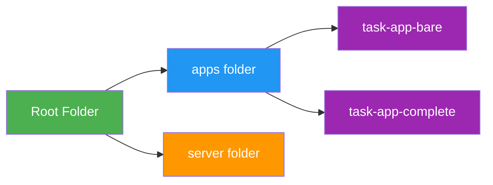

**What we learn:** Project structure

---

## Commit 2: Express Server + MongoDB

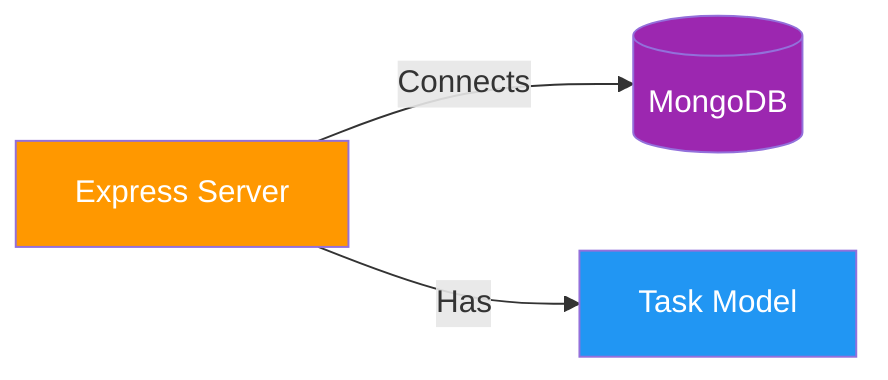

**What we learn:** Backend setup and database connection

---

## Commit 3: Task CRUD Endpoints

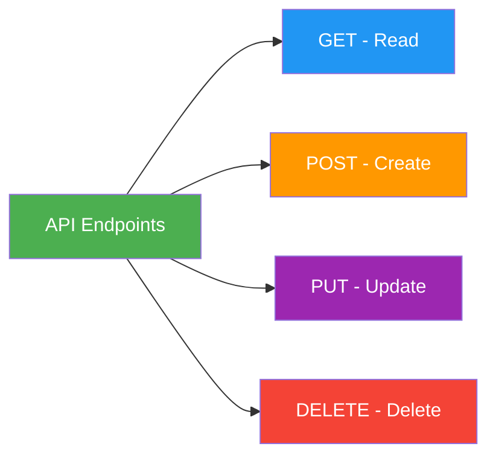

**What we learn:** REST API basics (CRUD operations)

---

## Commit 4: Auth Endpoints + JWT

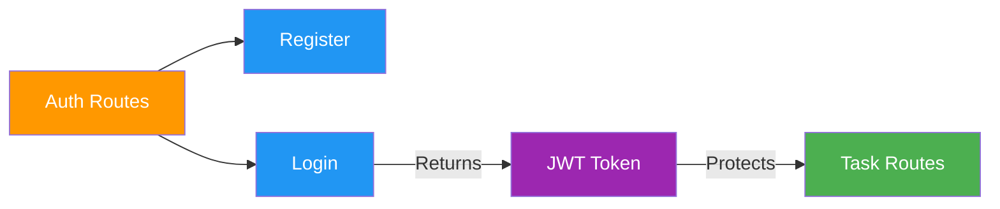

**What we learn:** Authentication and security

---

## Commit 5: Angular App Structure

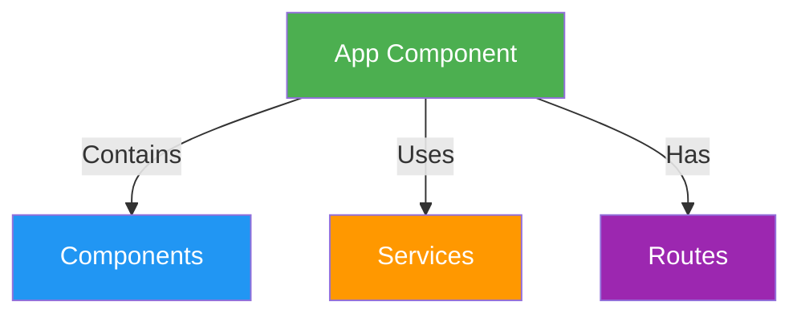

**What we learn:** Angular app structure

---

## Commit 6: Components and Templates

```mermaid
graph LR
    Component[Component] -->|Has| Template[Template HTML]
    Component -->|Has| Class[TypeScript Class]
    Template -->|Shows| Data[{{ data }}]
    
    style Component fill:#4CAF50,color:#fff
    style Template fill:#2196F3,color:#fff
    style Class fill:#FF9800,color:#fff
    style Data fill:#9C27B0,color:#fff
```

**What we learn:** Components = Template + Class

---

## Commit 7: Data Binding

```mermaid
graph LR
    Binding[Data Binding] -->|One way| Property[Property Binding<br/>[value]]
    Binding -->|One way| Event[Event Binding<br/>(click)]
    Binding -->|Two way| TwoWay[Two-way Binding<br/>[(ngModel)]]
    
    style Binding fill:#4CAF50,color:#fff
    style Property fill:#2196F3,color:#fff
    style Event fill:#FF9800,color:#fff
    style TwoWay fill:#9C27B0,color:#fff
```

**What we learn:** Three types of data binding

---

## Commit 8: Directives

```mermaid
graph LR
    Directives[Directives] --> NgIf[*ngIf<br/>Show or hide]
    Directives --> NgFor[*ngFor<br/>Loop through list]
    Directives --> NgClass[[ngClass]<br/>Add CSS classes]
    
    style Directives fill:#4CAF50,color:#fff
    style NgIf fill:#2196F3,color:#fff
    style NgFor fill:#FF9800,color:#fff
    style NgClass fill:#9C27B0,color:#fff
```

**What we learn:** Built-in Angular directives

---

## Commit 9: Pipes

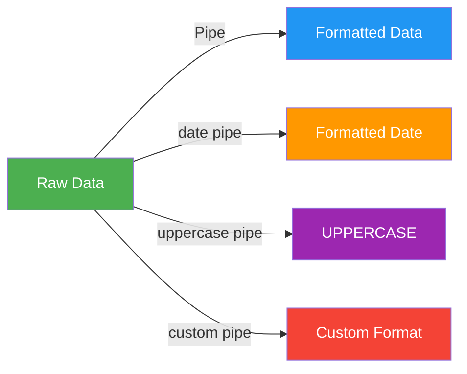

**What we learn:** Pipes transform data for display

---

## Commit 10: Routing

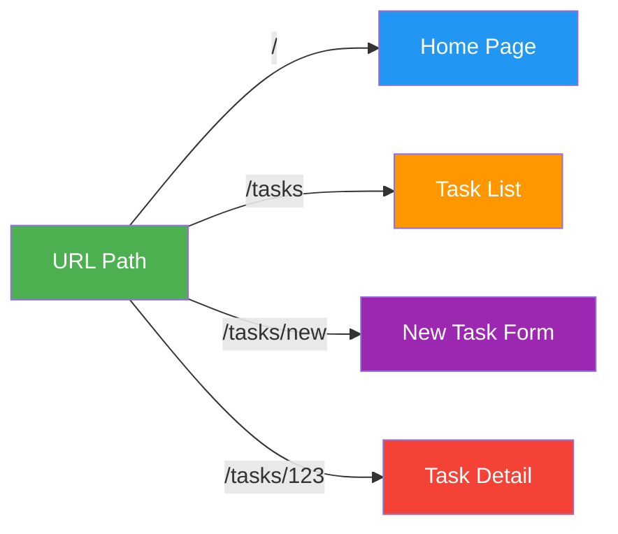

**What we learn:** Different URLs show different pages

---

## Commit 11: Forms and Validation

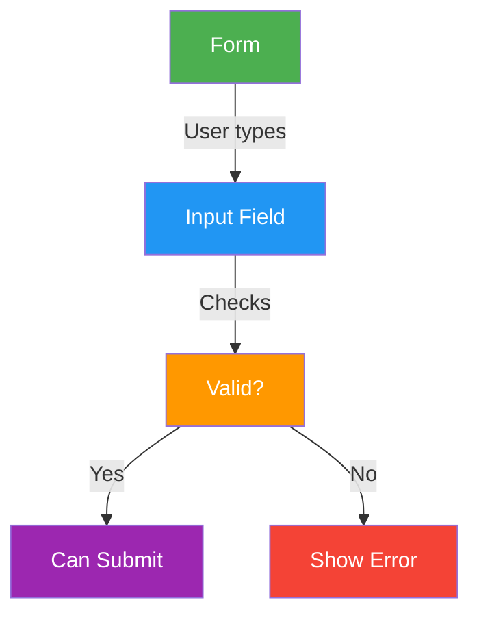

**What we learn:** Forms with validation rules

---

## Commit 12: Services and HTTP

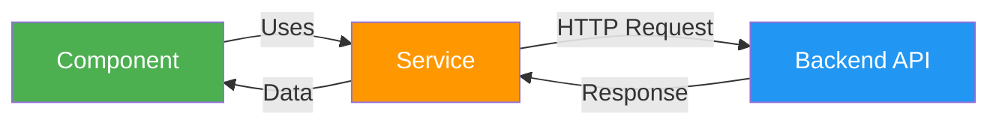

**What we learn:** Services get data from API

---

## Commit 13: Interceptors


**What we learn:** Interceptors modify requests and handle errors

---

## Commit 14: Auth Guard

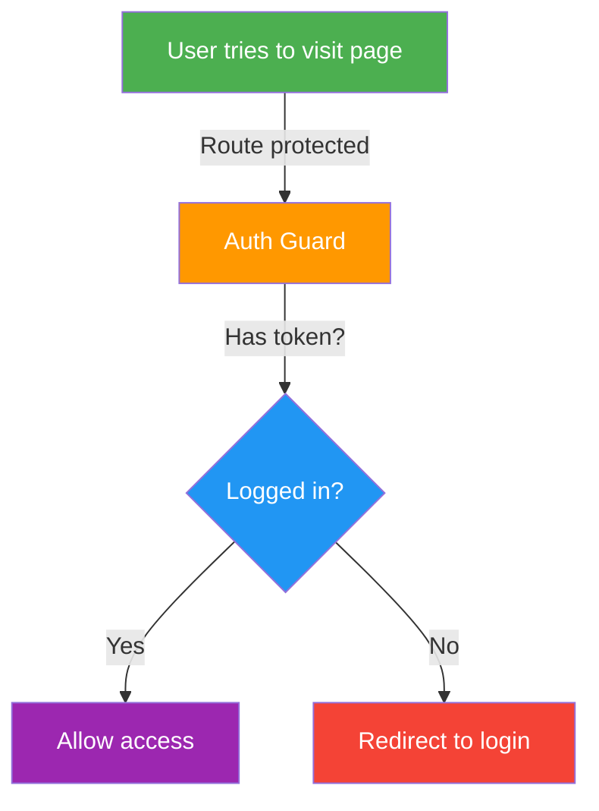

**What we learn:** Guards protect routes

---

## Commit 15: State Management

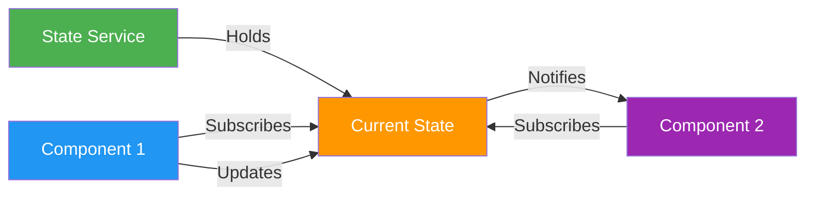

**What we learn:** Shared state between components

---

## Commit 16: Reusable Components

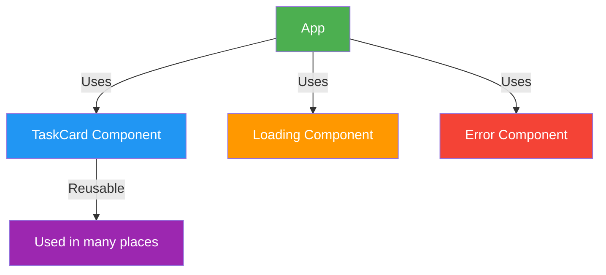

**What we learn:** Reusable UI components

---

## 🎓 Learning Path Summary

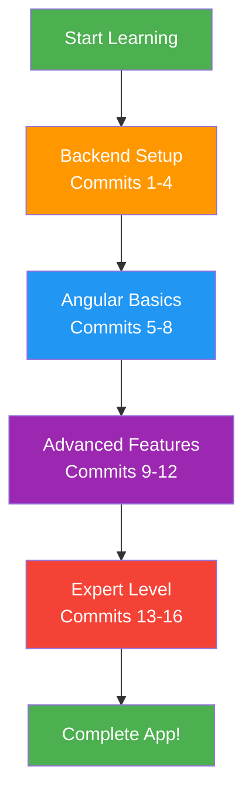
