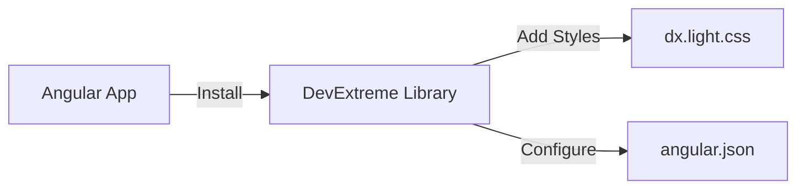
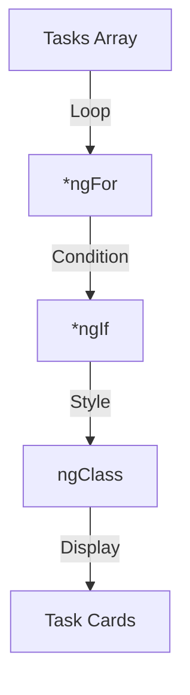
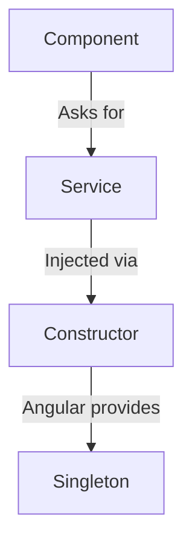
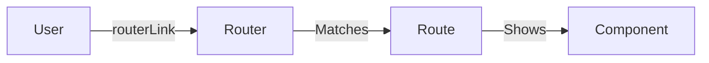
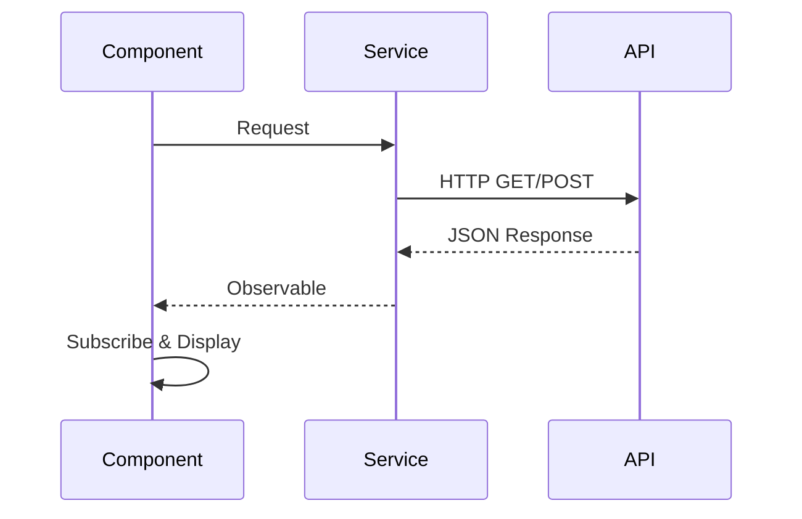
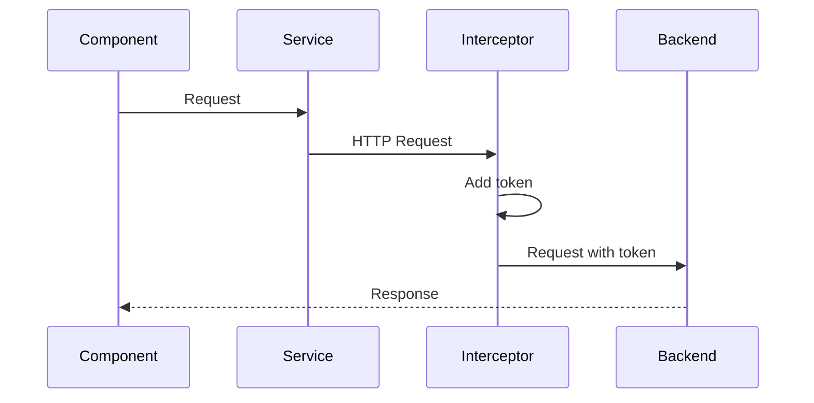
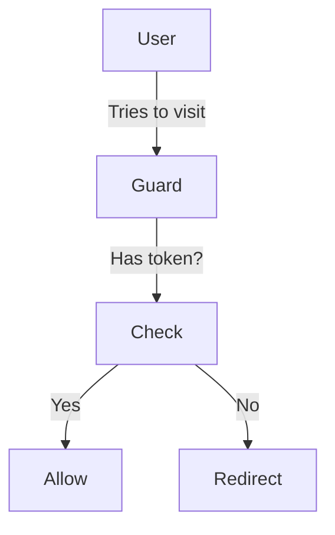
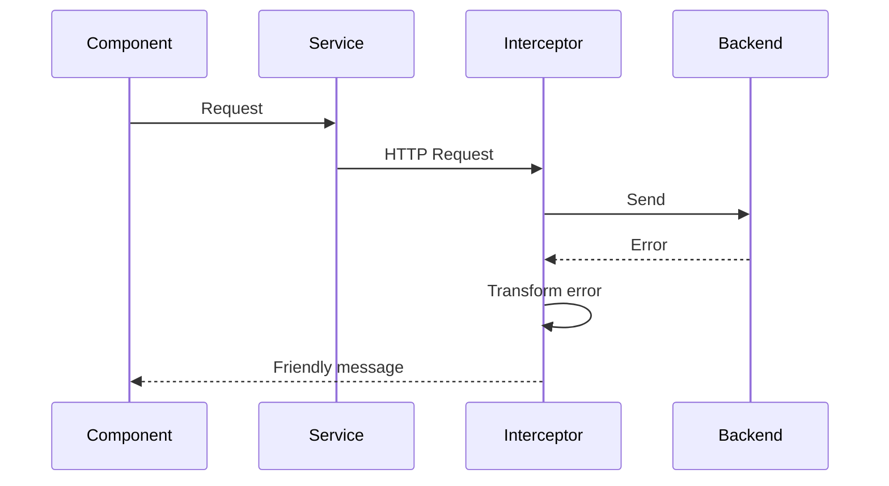

# 📚 Learning Path - Visual Guide

This document shows the complete learning journey through all commits with simple visual diagrams.

## 🎯 How to Use This Guide

1. **Start with COMMIT 01** and work through each commit in order
2. **Study the diagram** in each commit doc to understand the concept
3. **Read the explanation** to learn the details
4. **Practice** by building along with the commit

---

## 📊 Complete Learning Journey

### Commit 01: Setup
**What you learn:** Installing libraries and configuring Angular



**Key Concept:** Setting up external libraries

---

### Commit 02: Components & Interpolation
**What you learn:** Displaying data in templates

```mermaid
graph TD
    A[Component.ts] -->|Data| B[Component.html]
    B -->|Display| C[{{ property }}]
    C -->|Transform| D[Pipe]
    D -->|Show| E[User Sees Data]
```

**Key Concept:** Components display data using `{{ }}`

---

### Commit 03: Directives
**What you learn:** Making dynamic UIs with loops and conditions



**Key Concept:** `*ngFor` loops, `*ngIf` conditions, `[ngClass]` styling

---

### Commit 04: Component Communication
**What you learn:** Parent and child components talking

```mermaid
graph LR
    Parent -->|@Input| Child
    Child -->|@Output| Parent
    TwoWay -->|ngModel| Input
```

**Key Concept:** `@Input()` down, `@Output()` up, `[(ngModel)]` two-way

---

### Commit 05: Services & Dependency Injection
**What you learn:** Sharing code between components



**Key Concept:** Services = shared business logic

---

### Commit 06: Routing
**What you learn:** Multiple pages in one app



**Key Concept:** Routes = different URLs show different components

---

### Commit 07: Forms & Validation
**What you learn:** User input with validation

```mermaid
graph TD
    FormBuilder -->|Creates| FormGroup
    FormGroup -->|Contains| FormControls
    FormControls -->|Has| Validators
    Validators -->|Checks| User Input
```

**Key Concept:** Reactive forms with validation rules

---

### Commit 08: HTTP & API
**What you learn:** Getting data from backend



**Key Concept:** HttpClient makes HTTP requests, returns Observables

---

### Commit 08B: Auth Components
**What you learn:** Login and registration

```mermaid
graph TD
    User -->|Fills form| Login
    Login -->|Validates| Form
    Form -->|Valid| AuthService
    AuthService -->|HTTP POST| Backend
    Backend -->|Returns| JWT Token
    Token -->|Save| localStorage
```

**Key Concept:** Login flow with JWT tokens

---

### Commit 08C: Auth Interceptor
**What you learn:** Auto-add token to requests



**Key Concept:** Interceptors automatically add authentication

---

### Commit 08D: Auth Guard
**What you learn:** Protecting routes



**Key Concept:** Guards protect routes from unauthorized access

---

### Commit 09: RxJS Essentials
**What you learn:** Advanced observable patterns

```mermaid
graph LR
    Observable -->|pipe| Operators
    Operators -->|debounceTime| Wait
    Operators -->|switchMap| Cancel old
    Operators -->|shareReplay| Cache
    async pipe -->|Auto| Subscribe
```

**Key Concept:** RxJS operators transform data streams

---

### Commit 10: State Management
**What you learn:** Centralized state

```mermaid
graph TD
    StateService -->|BehaviorSubject| Single Source
    Single Source -->|Observable| Component 1
    Single Source -->|Observable| Component 2
    User Action -->|Update| StateService
    StateService -->|Emit| All Components
```

**Key Concept:** One state source, all components update automatically

---

### Commit 11: Error Interceptor
**What you learn:** Global error handling



**Key Concept:** Catch all errors, show user-friendly messages

---

### Commit 16: Reusable Components
**What you learn:** Building reusable UI components

```mermaid
graph TD
    Reusable --> Loading
    Reusable --> Dialog
    Reusable --> Error
    Any Component -->|Uses| Loading
    Any Component -->|Uses| Dialog
    Any Component -->|Uses| Error
```

**Key Concept:** Build once, use everywhere

---

## 🎓 Learning Progression

```
Setup → Components → Directives → Communication
  ↓
Services → Routing → Forms → HTTP
  ↓
Auth → RxJS → State → Errors → Reusable
```

## 💡 Tips for Success

1. **One commit at a time** - Don't skip ahead
2. **Study the diagram first** - Visual understanding helps
3. **Read the explanation** - Understand the "why"
4. **Build along** - Code it yourself
5. **Experiment** - Try variations

---

## 📁 Where to Find Each Diagram

Each commit document has its own diagram at the top:
- `COMMIT_01_SETUP.md` - Setup diagram
- `COMMIT_02_COMPONENTS.md` - Components diagram
- `COMMIT_03_DIRECTIVES.md` - Directives diagram
- ... and so on

---

**Happy Learning! 🚀**
